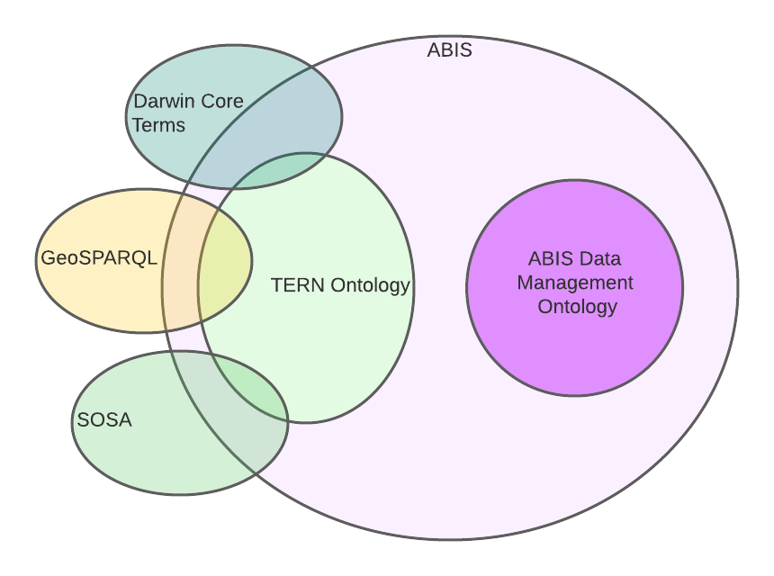

= ABIS Overview
:toc: left
:table-stripes: even
:sectnums:

By https://orcid.org/0000-0002-8742-7730[Nicholas Car]

This document is a short overview of the Australian Biodiversity Information Standard (ABIS). It is only one of many parts of the ABIS and all the parts are defined in the https://ausbigg.github.io/abis/standard.html[ABIS Standard Definition].

== What is ABIS?

ABIS is a data standard that specifies how information about biodiversity is to be represented for exchange and use in Australia. 

It is a technical data standard and mandates a specific form of machine-readable information representation: RDF (Resource Description Framework). RDF is "a standard model for data interchange on the Web"footnote:[https://www.w3.org/RDF/], so ABIS data is machine-readable and able to be sent between users over the web.

Use of the ABIS results in biodiversity information being formulated into data that can be validated against ABIS requirements in an automated way and the standard provides validators (see <<How do I use it?>>).

ABIS models domain-specific concepts itself but mostly re-uses existing models. <<ABIS Parts>> describes them.

=== ABIS Parts

ABIS draws on multiple, existing, domain standards for many of its parts. For example, ABIS requires use of the https://linkeddata.tern.org.au/information-models/overview[TERN Ontology] for the representation of _Sampling_, _Samples_, _Sites_ and most aspects of filed sampling. Another example: the https://www.ogc.org/[Open Geospatial Consortium]'s https://opengeospatial.github.io/ogc-geosparql/geosparql11/spec.html[GeoSPARQL Standard] must be used to represent spatial information.

The figure below shows the parts of ABIS and the list following it describes what they are all for.

[#abis-parts]
.The main part models within ABIS


https://www.tdwg.org/standards/dwc/[Darwin Core Terms], https://opengeospatial.github.io/ogc-geosparql/geosparql11/spec.html[GeoSPARQL] and https://www.w3.org/TR/vocab-ssn/[SOSA] are international standards for biological, spatial and observations data respectively. The https://linkeddata.tern.org.au/information-models/overview[TERN Ontology], which uses all three of them, is a domain model about 
sampling and surveying created by the Terrestrial Ecosystems Research Network and the ABIS Data Management Ontology provides additional properties for system management of TERN data.

== How do I use it?

The main things you can do with ABIS are:

* <<Create>>
** you can create data that conforms to ABIS
* <<Validate>>
** check that the data you've created is actually valid by applying a validator to it
* <<Exchange>>
** exchange ABIS data with organisations/systems that are designed to accept it, such as the Biodiversity Data Repository (BDR).

=== Create

ABIS data must be in an https://www.w3.org/RDF/[RDF] fomat. RDF is a data model for expressing graphs - nodes of information related by defined types of edges - and there are several different formats that can be used for RDF. All are technically equivalent but different forms suite different people.

Perhaps the best way to start is to consider this small example data about an observation.

==== Example - tree width observation

This observation is a tree in at Site X.

|===
| Observation ID | Long | Lat | Time | Site | Method Used | Result | Observer

| 4321 | 115.01 | -33.86 | 21/09/23, 2:02:03pm | Site X | Stem level measurements | 142cm | J. Bloggs
|===

We have an `Observation` - an ABIS class of thing - with ID 4321, taken at a location, (115.01, -33.86), and at a particular time. `Site` is also something known to ABIS - see the https://w3id.org/tern/ontologies/tern/Site[TERN Ontology's Site class definition].

We need to do a couple of things before turning this data into ABIS data:

2. *Conceptual split*
    * we need to place information about the observation and site into the conceptual model of ABIS
    * the TERN Ontology separates an observation into the act of observing and resulting data from the act: an `Observation` and a `Result`
    * ABIS also knows about a "Site", so for this data we have an https://w3id.org/tern/ontologies/tern/Observation[`Observation`], a https://w3id.org/tern/ontologies/tern/Result[`Result`], a https://w3id.org/tern/ontologies/tern/Site[`Site`], a https://www.w3.org/TR/vocab-ssn/#SOSAProcedure[`Procedure`] (see Method ID below) and a https://schema.org/Person[`Person`] - the observer
1. *IRIs for IDs*
    * we need IRIs to identify the observation and all the things according to the ABS concepts listed above
    * these need to be universally unique web addresses, like `https://linked.data.gov.au/dataset/bdr/eg/sample/4324`, not just `4321`
3. *Method IDs*
    * we need to ensure that any methods used are identified not in text but using a method listed in a controllec vocabulary
    * the method used here, _Stem level measurements_, is listed in one of TERN's methods vocab with ID http://linked.data.gov.au/def/tern-cv/a3a41c41-f74e-48ec-b11c-78de3c99ce35

For the first point, we need to either get a namespace for IRIs assigned to us for use - this is what the BDR team will do if you wish to send data to the BDR, but you can use other IRI systems if you are using ABIS data but not working with the BDR. Here we will just use `http://example.org/` for demonstrating.

Say we use the IRI `<http://example.com/obs/4321>` for the observation, `<http://example.com/site/x>` for Site X and `<https://orcid.org/0000-0000-1234-5678>` for the person who made the observation - perhaps the person is a scientist with an https://orcid.org[ORCID] they use to identify them in their publications - then we can make the following RDF, in the https://www.w3.org/TR/turtle/[Turtle] format:

```turtle
PREFIX geo: <http://www.opengis.net/ont/geosparql#>
PREFIX prov: <http://www.w3.org/ns/prov#>
PREFIX sdo: <https://schema.org/>
PREFIX sosa: <http://www.w3.org/ns/sosa/>
PREFIX tern: <https://w3id.org/tern/ontologies/tern/>
PREFIX void: <http://rdfs.org/ns/void#>
PREFIX xsd: <http://www.w3.org/2001/XMLSchema#>

<http://example.com/obs/4321>
    a tern:Observation ;
    prov:wasAssociatedWith <https://orcid.org/0000-0000-1234-5678> ;
    sosa:hasFeatureOfInterest <http://example.com/site/x> ;
    sosa:hasResult [
        a tern:Result ;
        sdo:value 142 ;
        sdo:unitCode <https://qudt.org/vocab/unit/CentiM> ;
    ] ;
    sosa:resultTime "2020-09-21T14:02:03"^^xsd:dateTime ;
    sosa:usedProcedure <http://linked.data.gov.au/def/tern-cv/a3a41c41-f74e-48ec-b11c-78de3c99ce35> ;
    void:inDataset <http://example.com/dataset/123> ;
    geo:hasGeometry [
        geo:asWKT "POINT(115.01, -33.86)"^^geo:wktLiteral
    ] ;
.

<http://example.com/site/x>
    a tern:Site ;
    geo:hasGeometry [
        geo:asWKT "POLYGON(115 -33, 115 -34, 116 -34, 116 -33, 115 -33)"^^geo:wktLiteral
    ] ;
.

<https://orcid.org/0000-0000-1234-5678>
    a sdo:Person ;
    sdo:name "Joe Bloggs" ;
    sdo:email "joebloggs@hotmail.com"^^xsd:anyURI ;
.
```

In the data above, the `Observation` is

```
<http://example.com/obs/4321>
    a tern:Observation ;
    # a series of other properties ..
.
```

There are many other examples of ABIS data in the https://ausbigg.github.io/abis/specification.html[Specification] and also in tools that 'talk' ABIS, for example the BDR Gateway: https://gateway.bdr.gov.au.

To test, you may want to create RDF data files by hand, however, for automated production of ABIS data, you should use any one of very many RDF generation tools - just search for them!

Note also that systems to convert non-RDF data to ABIS RDF have been established as part of the Biodiveristy Data Repository project, see https://submission.bdr.gov.au.

=== Validate

You can validate RDF data files against any or all of the validators for its part models using a SHACL validation tool. SHACL is a graph validation language and SHACL tools apply validators to data and report pass/fail and, if fail, error messages.

A free, online, SHACL validation tool that allows you to select from stored validators or add your own validator is:

* http://rdftools.kurrawong.net[RDF Tools]

All the ABIS validators are pre-loaded into the https://gateway.bdr.gov.au[BDR Gateway] and you may submit data to the Gateway's validation endpoint which is set up for testing. There are many pre-loaded valid and invalid examples of data there too to play with.

=== Exchange

If you have ABIS data that you want to submit to an ABIS system, you can do so by sending it in to the system in an automated way. For the BDR, you will need to have been issued with a BDR account and then you can send data to the https://gateway.bdr.gov.au[BDR Gateway]. The BDR is not the only system that undertstands ABIS data and other may accept submissions in other ways.

== Who owns it?

ABIS is owned by http://example.com[AusBIGG], the Australian Biodiversity Information Governance Group. That group is supported by the https://www.awe.gov.au[Department of Agriculture, Water and the Environment].

== How do I improve it?

Either contact AusBIGG or make direct contributions agains the ABIS repository that contains all of its source files:

* https://github.com/AusBIGG/abis

Submissions agains ABIS will be reviewed in regular AusBIGG meetings and AusBIGG members will vote on their acceptance.

== More help

Please be in contact with AusBIGG or read the https://ausbigg.github.io/abis/specification.html[ABIS Specification].
