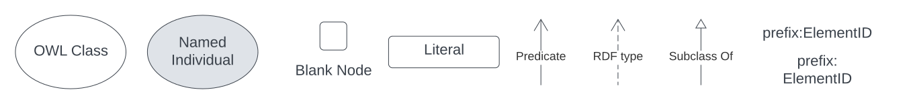
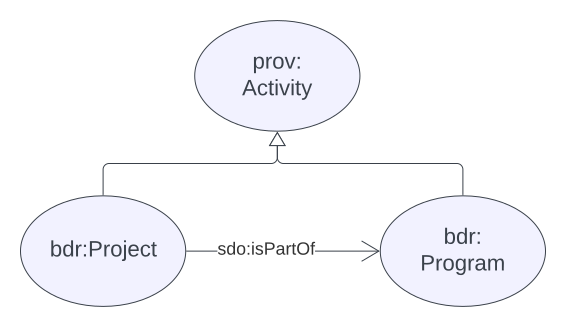
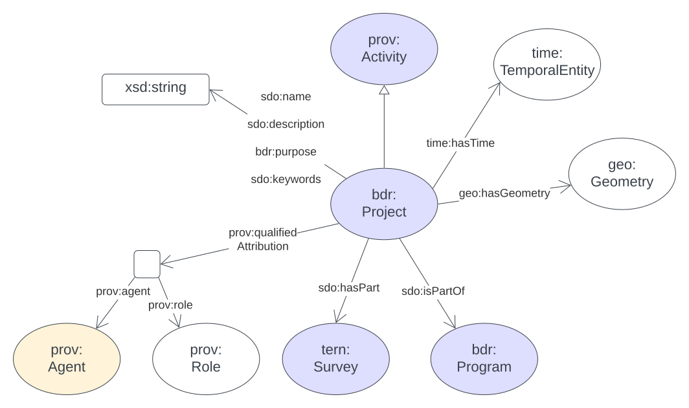
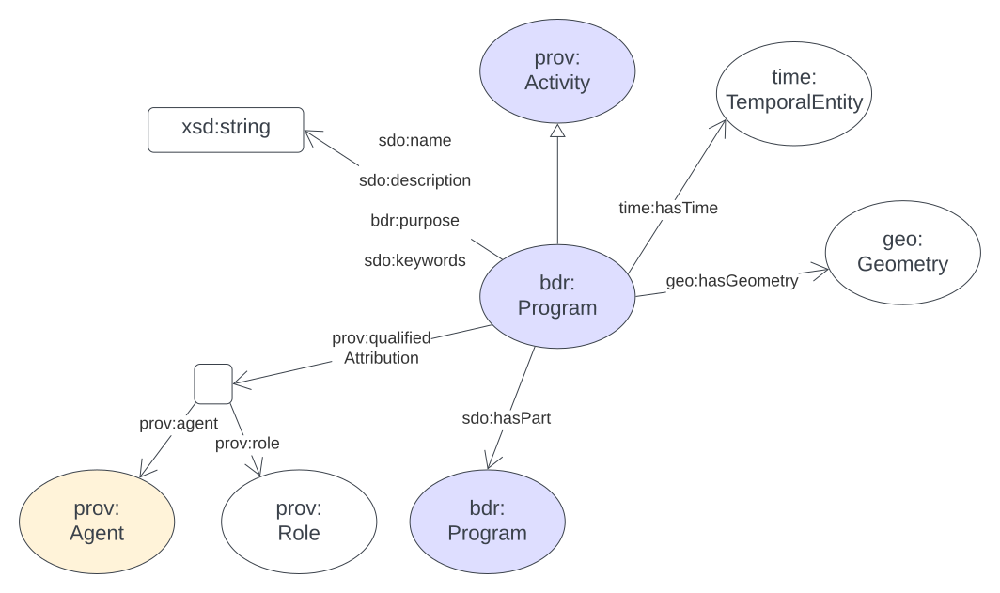
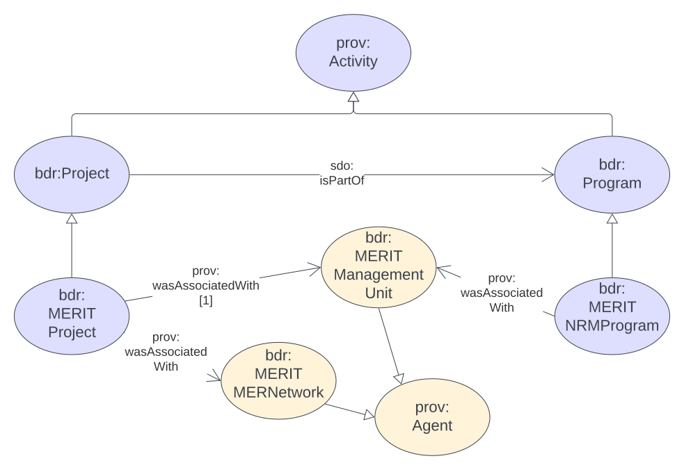

# ABIS Projects Component

This component of the [ABIS](https://linked.data.gov.au/def/abis) Data Model is used for the representation of Projects that run activities that generate data that flows into the [Biodiversity Data REpository](https://linked.data.gov.au/def/abis/spec#bdr).

This modelling uses the following dagram conventions:

Additionally, some ellipses - OWL Classes - are coloured, but not shaped, to match the PROV-O colour scheme at <https://www.w3.org/TR/prov-o/#starting-points-figure>, so subclasses of `Activity` are blue.

## General Project Data Model

### Project hierarchy

Generically, `Project`s are part of `Program`s and both are specialised forms of [PROV-O](https://www.w3.org/TR/prov-o/#Activity)'s `Activity`. An `Activity` is "is something that occurs over a period of time and acts upon or with entities" which means `Project`s & `Program`s can have all the properties that `Activities` do, such as temporal extents, `Agents` that have causal relationships to them and so on.

### Project class

A `Project` is "An Activity which requires concerted effort" and, in the context of ABIS/BDR, projects produce data that conforms to ABIS.

The following relations are expected for projects:

Note that the integration point for `Project` with the ABIS data model is the relationship between is and `tern:Survey` which is a part/whole relationship: a `Project` may have many `tern:Surveys` but a `tern:Surveys` can only ever be a part of one `Project`.

### Program Class

A `Program` is "An Activity which creates other Activities to achieve a stated outcome".

The following relations are expected for projects:

Indeed, the general relations of a `Program` are the same as those of a `Project` as they are both human-initiated and implemented `Activities` that have a spatial and temporal footprint.

## MERIT Extended Data Model

The MERIT program has a pre-existing data model for `Activities`, modelled in relation to the _General Project Data Model_ above as follows:

No properties of the MERIT specialised forms of `Project`/`Program` are yet modelled, other than some simple relations to MERIT Management Units and MER Networks which are thought to be types of `prov:Agent`. 