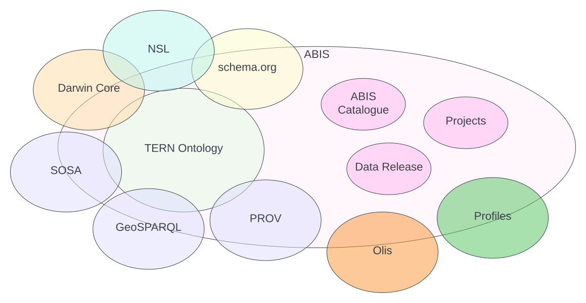

= Australian Biodiversity Information Standard
:Title: Australian Biodiversity Information Standard
:titletext: {title}
:doctype: book
:encoding: utf-8
:lang: en
:table-stripes: even
:toc: left
:toclevels: 3
:chapter-label:
:sectnums:
:sectnumlevels: 4
:sectanchors:
:figure-id: 0
:table-id: 0
:req-id: 0
:rec-id: 0
:per-id: 0
:xrefstyle: short
:source-highlighter: rouge

[#overview,link="img/overview.svg"]
.An overview of the major model parts of ABIS. The models shown here are detailed in the <<Multiple Models, Multiple Models>> section. Overlaps indicated shared model elements.

include::01-metadata.adoc[]

include::02-abstract.adoc[]

include::03-preamble.adoc[]

include::04-intro.adoc[]

include::05-patterns.adoc[]

include::06-models.adoc[]

include::07-vocabs.adoc[]

include::08-profiles.adoc[]

include::09-validation.adoc[]

include::10-mappings.adoc[]

include::11-reasoning-rules.adoc[]

include::99-references.adoc[]

:sectnums!:

include::50_annex_a.adoc[]

include::51_annex_b.adoc[]

include::52_annex_c.adoc[]

include::53_annex_d.adoc[]