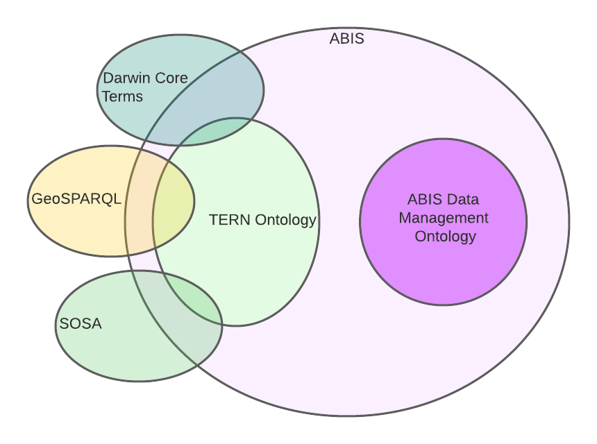

= Australian Biodiversity Information Standard
:Title: Australian Biodiversity Information Standard
:titletext: {title}
:doctype: book
:encoding: utf-8
:lang: en
:table-stripes: even
:toc: left
:toclevels: 3
:chapter-label:
:sectnums:
:sectnumlevels: 4
:sectanchors:
:figure-id: 0
:table-id: 0
:req-id: 0
:rec-id: 0
:per-id: 0
:xrefstyle: short
:source-highlighter: rouge

[#abis-parts]

== Metadata

[width=75%, frame=none, grid=none, cols="1,5"]
|===
|*IRI* | https://linked.data.gov.au/def/abis
|*Title* | Australian Biodiversity Information Standard
|*Definition* | This document is the normative specification of the Australian Biodiversity Information Standard and includes its authoritative statements on requirements, parts, patterns and models
|*Created* | 2021-10-24
|*Modified* | 2023-11-30
|*Issued* | 2023-12-01
|*Version* | 2.0
|*Creator* | Originally https://linked.data.gov.au/org/dawe[Department of Agriculture, Water and the Environment], +
now the https://linked.data.gov.au/org/dcceew[Department of Climate Change, Energy and the Environment]
|*Publisher* | https://linked.data.gov.au/org/dcceew[Department of Climate Change, Energy and the Environment]
|*License* | https://creativecommons.org/licenses/by/4.0/[Creative Commons Attribution 4.0 International (CC BY 4.0)]
|===

include::01-abstract.adoc[]

include::02-preamble.adoc[]

include::03-intro.adoc[]

include::04-patterns.adoc[]

include::05-model.adoc[]

include::06-vocabs.adoc[]

include::07-conformance.adoc[]

include::08-validation.adoc[]

include::99-references.adoc[]

:sectnums!:

include::14_annex_a_abis_parts.adoc[]

include::15_annex_b_bdr_messages.adoc[]