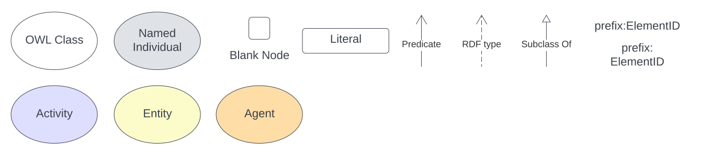

== Preamble

=== Parts of ABIS

The Australian Biodiversity Information Standard (ABIS) is a multi-part standard and this document is its normative specification.

The other parts of ABIS are:

* *Overview Document*
** https://linked.data.gov.au/def/abis/overview
** A simple introduction to the concepts within ABIS
* *Profile Definition*
** The technical expression of ABIS as a standard that inherits from other standards
** https://linked.data.gov.au/def/abis/profile
* *Models*
** ABIS is made of multiple models which are listed in the <<Models, Models Section>> but are published and maintained elsewhere
** Both human- and machine-readable forms of all ABIS models are available
* *Vocabularies*
** ABIS, and the modes it depends on, rely on many vocabularies
** These are described in the <<Vocabularies, Vocabularies Section>> but are published and maintained elsewhere
* *Validators*
** Data 'shape' files that can be used with validation tooling to check conformance of data to ABIS
** These are listed in the <<Validation, Validation Section>> but are published and maintained elsewhere
* *Mappings*
** Mappings of ABIS to/from other well-known standards or models in the same domain are given in the <<Mappings, Mappings Section>>
* *Reasoning Rules*
** Machine executable rules defined in the <<Reasoning Rules, Reasoning Rules Section>> that create new information from ABIS data based on logical, ontological, spatial and other reasoning
* *Data Objects*
** <<RDF, RDF>> expressions of this Standard, JSON-LD context files, examples and RDF forms of mappings etc. are given in the sections that describe the human-readable forms of those objects

=== Namespaces

Namespaces are used within the identifiers for model elements to ensure that they are globally unique. For example, the <<TERNOntology, TERN Ontology>>'s `Sample` class is identified by the <<IRI, IRI>> `https://w3id.org/tern/ontologies/tern/Sample` which distinguishes it from the <<SOSA, SOSA>> `Sample` class, identified with `http://www.w3.org/ns/sosa/Sample` that it is based on but extends.

Namespaces are used in shortened form in documents and data by assigning them a prefix and the prefixes used in this document are given in the table below.

[frame=none, grid=none, cols="1,3,3"]
|===
|Prefix | Namespace | Description
|`abis:` | `https://linked.data.gov.au/def/abis/` | *ABIS namespace* - for this Standard
|`bdr:` | `https://linked.data.gov.au/dataset/bdr/` | BDR Dataset Namespace
|`dwc:` | `http://rs.tdwg.org/dwc/terms/` | <<DWC, Darwin Core Terms>> namespace
|`ego:` | `https://w3id.org/idn/def/ego/` | Extended Geometries Ontology
|`ex:` | `+http://example.com/+` | Generic examples namespace - _does not resolve_
|`geo:` | `http://www.opengis.net/ont/geosparql#` | <<GSP, GeoSPARQL Ontology>> namespace
|`owl:` | `http://www.w3.org/2002/07/owl#` | <<OWL2, Web Ontology Language ontology>> namespace
|`rdfs:` | `http://www.w3.org/2000/01/rdf-schema#` | <<RDFSSPEC, RDF Schema ontology>> namespace
|`sosa:` | `http://www.w3.org/ns/sosa/` | <<SOSA, Sensor, Observation, Sample, and Actuator (SOSA) ontology>> namespace
|`schema:` | `https://schema.org/` | <<SDO, schema.org>> namespace
|`skos:` | `http://www.w3.org/2004/02/skos/core#` | <<SKOS, Simple Knowledge Organization System (SKOS) ontology>> namespace
|`tern:` | `https://w3id.org/tern/ontologies/tern/` | <<TERNOntology, TERN Ontology>> namespace
|`time:` | `http://www.w3.org/2006/time#` | <<TIME, Time Ontology>> in OWL namespace
|`void:` | `http://rdfs.org/ns/void#` | <<VOID, Vocabulary of Interlinked Data (VoID) ontology>> namespace
|`xsd:` | `http://www.w3.org/2001/XMLSchema#` | <<XSD2, XML Schema Definitions ontology>> namespace
|===

Using the table above, the <<TERNOntology, TERN Ontology>>'s `Sample` class would be identified as `tern:Sample` and the <<SOSA, SOSA>> `Sample` class as `sosa:Sample`.

[NOTE]
====
A JSON-LD _context_ built from this namespaces table is available as another resource within the ABIS specification and is online at:

https://linked.data.gov.au/def/abis/context.json
====

=== Terms & Definitions

The following terms & definitions are used throughout this document.

[[ABIS]]
ABIS:: The Australian Biodiversity Standard - the data standard this document is about

[[BDR]]
BDR:: Biodiversity Data Repository - a data collection managed by the https://linked.data.gov.au/org/dcceew[Department of Climate Change, Energy and the Environment] that incorporates biodiversity observations from State & Territory jurisdictions and aims to incorporate non-government data too

[[BN]]
Blank Node:: A Blank Node is a node within <<RDF, RDF>> data that does not have a globally unique or even persistent identifier, instead it is a node that is identifiable only in relation to the other nodes in the RDF data in which it is recorded. Blank Nodes are used to convey things that are entirely dependent on, and meaningless without, other things, for example values for https://linkeddata.tern.org.au/viewers/tern-ontology?resource=https://w3id.org/tern/ontologies/tern/Result[`tern:Result`] classes which only mean something in relation to the https://linkeddata.tern.org.au/viewers/tern-ontology?resource=https://w3id.org/tern/ontologies/tern/Observation[`tern:Observation`] that generated them

[[IRI]]
IRI:: An https://en.wikipedia.org/wiki/Internationalized_Resource_Identifier[Internationalized Resource Identifier] is a web address-style URL that is used as an identifier for something. It may be for a real-world object, e.g. https://linked.data.gov.au/dataset/qldgeofeatures/AnakieProvince identifies the Queensland Geological Feature Anakie Province or for data only, e.g. https://w3id.org/tern/ontologies/tern/Text which identifies the class of 'Text' - textual results - within the <<TERNOntology, TERN Ontology>>.
+
IRIs do not have to resolve - go somewhere online when clicked - but they do have to follow all the rules for URLs, such as no spaces.

[[Class]]
Class:: Based on the mathematical notion of a _set_, within formal OWL modelling, a class is a set of objects exhibiting common properties. For example, the set of all people who are studying could be defined as being within a Student class.

[[KnowledgeGraph]]
Knowledge Graph:: A data holding that implements node-edge-node (graph) data structures. The 'knowledge' part is often taken to indicate that the graph contains refined information, not just pure, raw, data.

[[LinkedData]]
Linked Data:: A series of technologies and methodologies for the publication of data on the Internet. Uses <<RDF, RDF>> as its underlying data structure, <<OWL, OWL>> as its data model and the common mechanics of the Domain Name System (DNS) and the Hypertext Transfer Protocol (HTTP) to identify and share its data.

[[OWL]]
OWL:: The OWL 2 Web Ontology Language, informally OWL 2, is an ontology language for the Semantic Web with formally defined meaning. OWL 2 ontologies provide classes, properties, individuals, and data values and are stored as Semantic Web documents. OWL 2 ontologies can be used along with information written in RDF, and OWL 2 ontologies themselves are primarily exchanged as RDF documents. Reference: <<OWL2, OWL2>>

[[Predicate]]
Predicate:: Predicates, within formal OWL modelling, are the defined relations between objects of different classes (see <<Class, Class>>) and also between objects and simple data values such as numbers and dates. For example, if Person X "knows" Person Y, then we can use a predicate of _knows_ to relate them.
+
Frequently we use predicates already defined in existing ontologies. "knows", for example, is defined in the schema.org ontology <<SDO, SDO>> to be "The most generic bi-directional social/work relation".

[[RDF]]
RDF:: The Resource Description Framework (RDF) is a data structure for representing information on the Web. RDF is made of identified nodes linked by typed edges that form graphs. Node/edge/node associations are often called 'triples'. Reference: <<RDFSPEC, RDF>>

[[SemanticWeb]]
Semantic Web:: A vision of a machine-understandable Internet, created in the year 2000, and thought to be attainable through the use of Linked Data.

[[SPARQL]]
SPARQL:: SPARQL is a query language for RDF. SPARQL matches patterns within RDF data to extract subsets of a graph. The results of SPARQL queries can be subset graphs or data in tabular form.

=== Conventions

[discrete]
==== Figures

In this document, figures showing model elements use the following key:

[#key,link="img/key.svg"]
.Key of model figure elements. `Activity`, `Entity` and `Agent` are classes from <<PROV, The Provenance Ontology>> and indicate temporal events, all manner of things and people and organisations with agency, respectively. Where `prefix:ElementID` is used, the prefix refers to entries in the <<Namespaces, Namespaces table>>.

[discrete]
==== Code
Where examples of ABIS data are given in this document, <<RDFSPEC, RDF>> data serialised in the <<TURTLE, Turtle>> format is used. For example:

[source,turtle]
----
PREFIX ex: <https://example.com/dataset/>
PREFIX schema: <https://schema.org/>
PREFIX tern: <https://w3id.org/tern/ontologies/tern/>

ex:x
    a schema:Dataset ;
    schema:name "Dataset X" ;
    schema:hasPart <https://example.com/dataset/sample/y> ;
.

<https://example.com/dataset/sample/y>
    a tern:Sample ;
    schema:name "Sample Y" ;
.
----

The above example data, while invalid according to the ABIS <<Validation, Validator>>, provides a simple example of a _dataset_ and a _sample_ and a relationship between them, encoded in Turtle.

If prefixes - `ex:`, `schema:` and `tern:` in the example above - are not declared within the example, as they are here - lines starting `PREFIX` - then they will be found in the <<Namespaces, Namespaces>> table above.