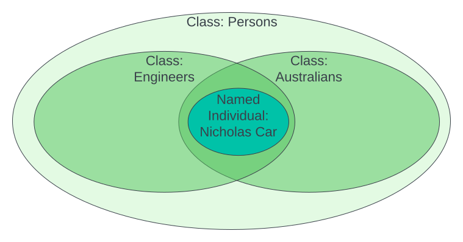
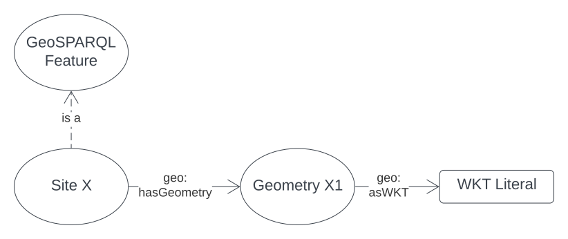
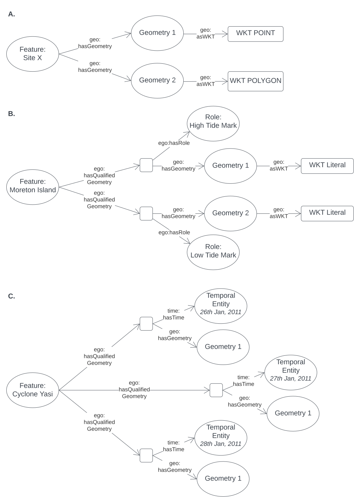
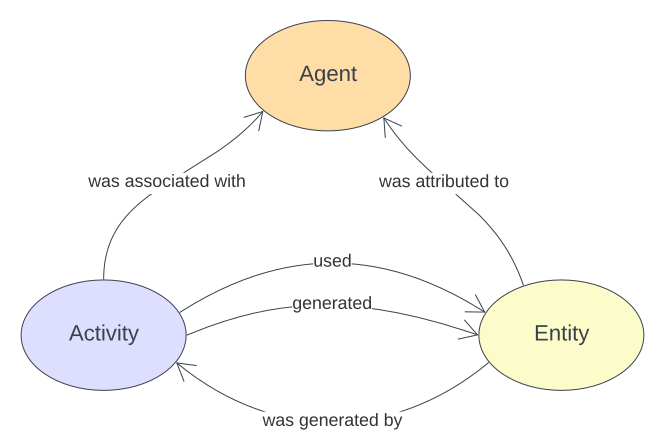
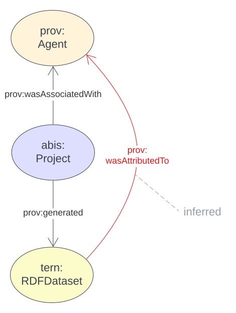
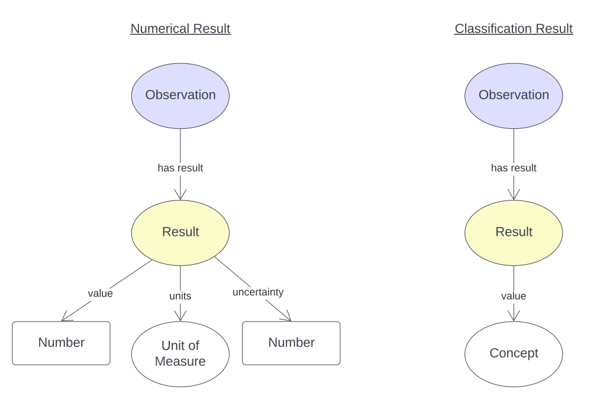
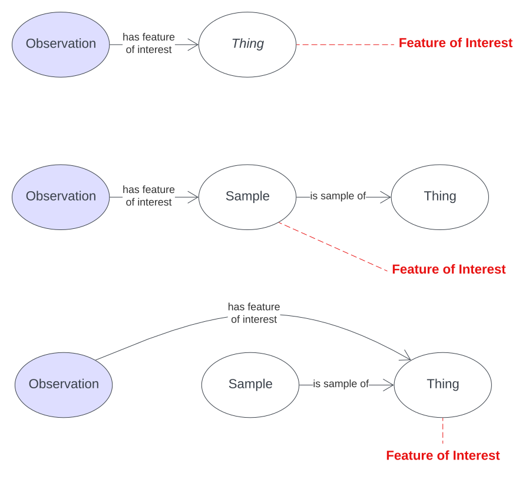

== Patterns

This section describes some modelling patterns implemented in ABIS. Most of these patterns are inherited from the models that ABIS profiles.

=== Set Modelling

The most basic pattern used by this model and all the <<OWL2, OWL>>-based models it profiles is that of https://en.wikipedia.org/wiki/Set_theory[Set Theory] modelling, that is, modelling according to the mathematical notion of sets.

The basic principles are that things - all things - can be modelled as atomic objects and groups of objects known as _sets_. The basic object/set relations (_membership_ of an object within a set) and set/set relations (_union_, _intersection_, _disjoint_ etc.) are likely familiar to all Australian high school graduates.

In OWL modelling, objects are usually called Named Individuals or Instances and sets are called Classes.

The set of all people, the class `Person` is defined like this:

----
ex:Person
    a owl:Class ;
    sdo:name "Person" ;
    sdo:description "Persons are individuals of the species Homo sapiens" ;
.
----

`Nicholas Car` is an object in the set of `Person` so, in OWL modelling, `Nicholas Car` is a  Named Individual of type `Person`:

----
ex:nicholasCar
    a ex:Person ;
    sdo:name "Nicholas Car" ;
    sdo:description "Nicholas is a Person, born in South Africa, now living in Brisbane" ;
.
----

Subsetting is very important in OWL: `Nicholas Car` might also be an `Engineer` where `Engineer` is defined as a subset of `Person`. This means every `Engineer` is also a `Person` but not all `Person` objects are `Engineers`:

----
ex:nicholasCar
    a ex:Engineer ;
    sdo:name "Nicholas Car" ;
    sdo:description "Nicholas is an Engineer, born in South Africa, now living in Brisbane" ;
.

ex:Engineer rdfs:subClassOf ex:Person .
----

In OWL modelling, classes may be seen by grouping instances with similar properties. `Nicholas Car` might be understood to be an Australian by virtue of the predicate `citizenship` being given for him indicating `Australian`:

----
ex:nicholasCar
    a ex:Person ;
    sdo:name "Nicholas Car" ;
    ex:citizenship ex:Australian ;
.
----

The figure below shows Nicholas Car, the individual, declared as a `Person`, and `Engineer` and understood to be an `Australian`.

[#pattern-sets,link="img/pattern-sets.svg"]
.Set Modelling using OWL: The Named Individual `Nicholas Car` and three Classes he is a member of and which are subclasses of others.

In the domain of ABIS, all animals living in the sea constitute the class marine animals and there are intersecting classes of terrestrial animals for things like crabs and penguins that live both in the sea and on land.

=== Identifiers

All objects in OWL modelling - classes, predicates and instances of classes - are identified either with an <<IRI, IRI>> or a <<BN, Blank Node>>. Classes and predicates defined in ABIS or inherited from models it profiles use the identifiers for them given in this document. Instances of classes, for example a particular sample, _Sample Y_ of the class https://linkeddata.tern.org.au/viewers/tern-ontology?uri=https://w3id.org/tern/ontologies/tern/Sample[`Sample`], are identified by IRIs assigned to them often deriving from the IRI of an identified dataset in which they are first presented. If the instance is referred to again later - perhaps further observations were made on the sample - then the original identifier is still used. An example for _Sample Y_ in _Dataset X_ which also contains _Observation Z_:

----
<http://example.com/dataset/x>
    a tern:RDFDataset ;
    sdo:hasPart
        <http://example.com/dataset/x/sample/y> ,
        <http://example.com/dataset/x/obs/z> ;
.

<http://example.com/dataset/x/sample/y>
    a tern:Sample ;
.

<http://example.com/dataset/x/obs/z>
    a tern:Observation ;
    sosa:hasFeatureOfInterest <http://example.com/dataset/x/sample/y> ;
.
----

Identifiers for datasets take the form `https://{IRI-STEM}/{DATASET-ID}` and act as a unique namespace for objects within it. If Dataset `abc-123-def-456` contained Sample Y, we may have the following identifiers:

* *Dataset abc-123-def-456*: `+https://linked.data.gov.au/dataset/abc-123-def-456+`
** A unique dataset IRI issued by the https://linked.data.gov.au/agldwg[Australian Government Linked Data Working Group] using the `+https://linked.data.gov.au/dataset/+` namespace
** Other identifier issuing regimes/organisations may be used
** Dataset X's Namespace: `+https://linked.data.gov.au/dataset/abc-123-def-456/+` - ending in a '/'
* *Sample Y*: `+https://linked.data.gov.au/dataset/abc-123-def-456/sample/y+`
** Uses the Dataset Namespace and a class identifier (optional) of 'sample' and an ID for the particular sample - 'y'
** Datasets can create identifiers for their elements, within their namespace however they like

It is likely that initiatives will be created to manage data for Sites, Samples or other classes of object that ABIS knows about. If so, these initiatives might issue identifiers for those things and, if they do, those identifiers should be used. See the next section for how.

[discrete]
==== Alternate Identifiers

Many objects represented using ABIS will usefully have external identifiers recorded. One case could be samples that have museum IDs, another, datasets already listed in a catalogue that have web page URLs.

All forms of alternate identifiers may be recorded and how they are recorded and used depends on how they function.

[discrete]
===== Alternate IRIs

If an object already has an IRI identifier, and that identifier responds to <<LinkedData, Linked Data>> operations, it _MAY_ be used as the primary identifier of the object.

* If Dataset X contains a representation of Site Y and Site Y has the IRI of `http://linked.data.gov.au/dataset/ausplots-forest/site-nsfnnc0002` assigned to it by TERN, then that IRI _MAY_ be used as the IRI for the site as it is resolvable online, linking to RDF data (and human-readable data)
* If Dataset X contains a representation of Sample Z and Sample Z has an https://ev.igsn.org/[International GeoSample Identifier (IGSN)] or https://www.doi.org/[DOI] IRI of `https://doi.org/10.58052/IECUR00N9` then that IRI _MAY NOT_ be used as the IRI for the sample for, while it resolves online to a web page, it does not link to RDF data

If an object has a Linked Data IRI assigned to it AND another assigned to it within an ABIS data generation propcess, perhaps automatically, the two IRIs should be linked like this:

----
<{ORIGINAL-IRI}> owl:sameAs <{NEW-IRI]}>
----

Here the <<OWL2, OWL>> predicate http://www.w3.org/2002/07/owl#sameAs[`owl:sameAs`] indicates the two IRIs identify the same thing.

If an object has an IRI assigned to it that does not link to RDF data, it should be recorded in the following manner:

----
<{NEW-IRI]}>
    sdo:identifier "{ORIGINAL-IRI}"^^{DATATYPE} ;
    ...  # other properties
.
----

Here the `{ORIGINAL-IRI}`, since it does not act as a Linked Data IRI, is indicated as being a literal of a specified data type.

If the datatype of the `{ORIGINAL-IRI}` is of a known form, such as a DOI or IGSN, then that type might be found in the _BDR Datatypes Register_ #TODO: link to datatypes register# and it should be used. If its type is not known or is a generic URL, the type `xsd:anyURI` should be used like this:

----
<{NEW-IRI]}>
    sdo:identifier "{ORIGINAL-IRI}"^^xsd:anyURI ;
    ...  # other properties
.
----

[discrete]
===== Alternate IDs - non-IRIs

Alternate identifiers for objects that are not IRIs/URLs _MUST_ have their identifier regime indicated. For example, if Museum X issues identifiers for samples and Sample Y has an issued identifier of `SAM-Y1234`, then this should be given like this:

----
<{SAMPLE-IRI]}>
    a tern:Sample ;
    sdo:identifier "SAM-Y1234"^^ex:museum-x-id ;
    ...  # other properties
.
----

...where `{DATASET-IRI]}` is an IRI assigned to the _sample_ and the predicate `sdo:identifier` is used to give the literal identifier value of `SAM-Y1234` which has the datatype `ex:museum-x-id` indicated.

Datatypes such as the example `ex:museum-x-ids` used here _MUST_ be registered to be useful.

[NOTE]
====
ABIS data destined for the Biodiversity Data Repository _MUST_ have identifier datatypes registered in the _BDR Datatypes Register_ #TODO: link to datatypes register#
====

Multiple alternate identifiers may be given, as long as their datatypes are unique:

----
<{SAMPLE-IRI]}>
    a tern:Sample ;
    sdo:identifier
        "SAM-Y1234"^^ex:museum-x-id ,
        "1073/SAMY"^^ex:igsn ;
    ...  # other properties
.
----

=== Spatially

_ABIS inherits its spatial modelling from <<GSP, GeoSPARQL>>, as does the <<TERNOntology, TERN Ontology>>._

GeoSPARQL uses a "feature-centric" method of spatial modelling which means spatial things are represented as conceptual things first - spatial _features_ - and then a spatial projection or representation - _geometry_ - is linked to it. This is different to some GIS systems that model spatial things as geometries first and then apply properties to them.

[#pattern-spatiality-basic,link="img/pattern-spatiality-basic.svg"]
.A `Feature`, such as a `Site`, can be assigned a `Geometry` with any one of a number of representations. ABIS prefers the https://en.wikipedia.org/wiki/Well-known_text_representation_of_geometry[Well-Known Text] representation of coordinates.

This feature-centric model allows for multiple or no geometries per spatial object which can be very powerful. The figure below gives several examples of a spatial feature with multiple geometries that differ different ways.

[#pattern-spatiality,link="img/pattern-spatiality-qual.svg"]
.Spatial `Features` and `Geometries` as modelled in the <<GSP, GeoSPARQL>> ontology with subfigure *A.* showing a `Site` feature that has two geometries provided for it: a Point and a Polygon. These could respectively represent the site's centroid and is boundary. subfigure *B.* shows a feature - Moreton Island - with multiple two boundary polygonal geometries _role_. Subfigure *C.* shows a time-varying feature with multiple geometries seperated by time. Note the use of the property https://idn-au.github.io/ext-geom-ont/ego.html#hasQualifiedGeometry[`ego:hasQualifiedGeometry`] to indicate qualified geometries instead of the usual https://opengeospatial.github.io/ogc-geosparql/geosparql11/spec.html#geo:hasGeometry[`geo:hasGeometry`] to indicate an un-qualified geometry.

ABIS will perform spatial reasoning on data. For example, if a dataset is presented that contains a https://w3id.org/tern/ontologies/tern/Survey[`Survey`] which, in turn, contains a series of https://w3id.org/tern/ontologies/tern/Observation[`Observation`] instances with their spatial locations indicated, the spatial extent of the `Survey` will be taken to be at least the area containing the `Observation` locations. The dataset's extent will be at least the boundary of all contained `Survey` instances areas. Spatial reasoning like this and other reasoning are related in ABIS' <<Reasoning Rules, Reasoning Rules>> section.

=== Temporality

_ABIS inherits its temporal modelling from the <<TIME, Time Ontology>>. The <<TERNOntology, TERN Ontology>> uses the Time Ontology in places and used direct time representations elsewhere. This may be harmonised in the future._

=== Provenance

How things derive from other things, when and where this occurs and who may be responsible for actions is the domain of the <<PROV, Provenance Ontology (PROV)>> which is one of ABIS's Background Models.

PROV's basic classes and the predicates that relate them to one another are given below.

[#pattern-prov-basic,link="img/pattern-prov-basic.svg"]
.Basic PROV classes and predicates

Many of ABIS' models follow on from the pattern in the figure above and many figures further down in this document are coloured according to PROV's basic classes. For example, the <<TERNOntology, TERN Ontology>>'s https://linkeddata.tern.org.au/viewers/tern-ontology?uri=https://w3id.org/tern/ontologies/tern/Sampling[`Sampling`] class is a subclass of PROV's https://www.w3.org/TR/prov-o/#Activity[`Activity`] class and instances of it may have https://www.w3.org/TR/prov-o/#used[`used`] an instance of a https://linkeddata.tern.org.au/viewers/tern-ontology?uri=https://w3id.org/tern/ontologies/tern/Site[`Site`], which is a subclass of PROV's https://www.w3.org/TR/prov-o/#Activity[`Entity`], to have https://www.w3.org/TR/prov-o/#generated[`generated`] an instance of the class https://linkeddata.tern.org.au/viewers/tern-ontology?uri=https://w3id.org/tern/ontologies/tern/Sample[`Sample`] which is another subclass of https://www.w3.org/TR/prov-o/#Entity[`Entity`].

The figures in the <<Observations & Results, Observations & Results>> and the <<Feature of Interest, Feature of Interest>> patterns use this colouring.

PROV's provenance reasoning is also applicable to parts of ABIS. For example, the <<#annex-a, Projects Model>> indicates that instances of its <<abis:Project, `Project`>> class, which is a subclass of PROV's https://www.w3.org/TR/prov-o/#Activity[`Activity`], can have https://www.w3.org/TR/prov-o/#generated[`generated`] instances of the <<TERNOntology, TERN Ontology>>'s  https://linkeddata.tern.org.au/viewers/tern-ontology?uri=https://w3id.org/tern/ontologies/tern/RDFDataset[`RDFDataset`] class, which is a subclass of PROV's https://www.w3.org/TR/prov-o/#Entity[`Entity`], and may have been associated with an https://www.w3.org/TR/prov-o/#Agent[`Agent`] - an Organisation or Person. If so, then the resulting `RDFDataset` instances will be able to have an attributional relationship to the `Agent` instance calculated. This is shown in the figure below.

[#pattern-prov-reasoning,link="img/pattern-prov-reasoning.svg"]
.PROV-style reasoning using facts given in the <<Projects Model, Projects Model>>

=== Agents

=== Observations & Results

_This pattern is inherited from the <<TERNOntology, TERN Ontology>>, which, in turn, inherits it from <<SOSA, SOSA>>._

The _result_ of any _observation_ in ABIS is a numerical or classification _value_ for an _observed property_ of a _feature of interest_ (see next pattern).

The _observation_ act is a temporal activity which, recorded or not, follows some _procedure_.

The _value_ may be qualified with units of measure and uncertainty.

[#pattern-obs-result,link="img/pattern-obs-result.svg"]
.Two styles of Result: a numerical and a classification

Using this pattern, the thing that ties the result value to the property of the thing observed is the _observation_.

NOTE:: Since _observations_ record when a result was produced, multiple observations of the property of a thing can be recorded over time, such as multiple estimations of the taxon of a specimen.

=== Feature of Interest

A _feature of interest_ is the object of some activity's focus. This is a relative term: when an _observation_ considers the property of something - perhaps the colour of a part of a leaf - then the part leaf only - a sample of it - is the _feature of interest_. If the _observation_ were to consider the colour of the whole leaf, then the leaf is the _feature of interest_. If the colour of the whole bush from which the leaf came was considered, then the whole bush is the _feature of interest_.

If the average colour of a whole area of bushland was considered, the _feature of interest_ would be the whole area, not any single bush or plant within it.

[#pattern-foi,link="img/pattern-foi.svg"]
.Three Features if Interest indicated with respect to the Observation that is observing properties of them. Whether something is a sample of something else doesn't affect its status as a Feature of Interest with respect to an Observation.

