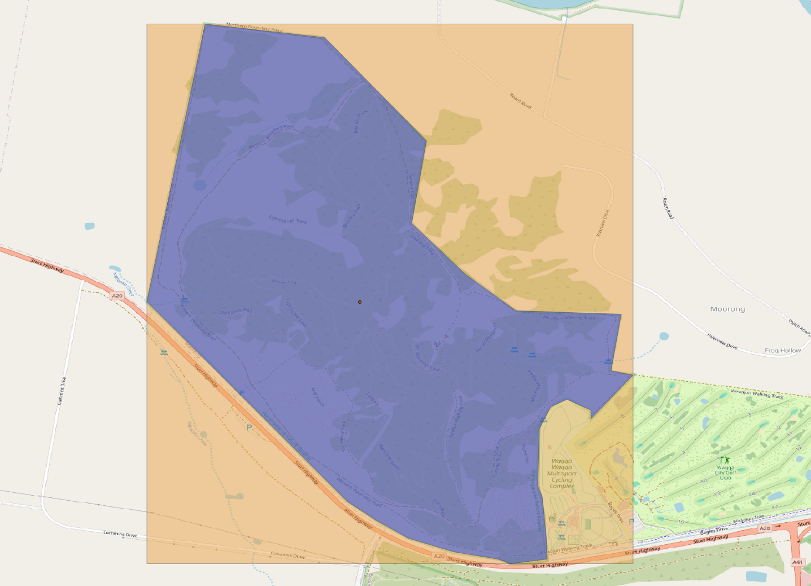
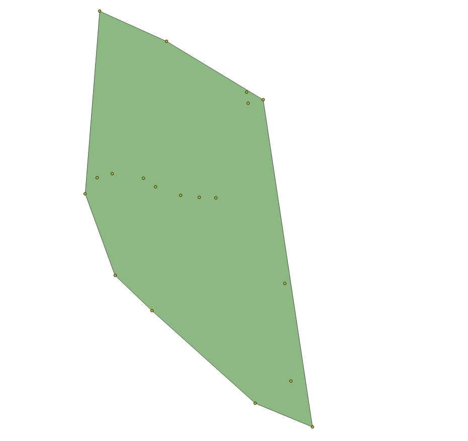

== Patterns

This section describes some modelling patterns implemented in ABIS. Most of these patterns are inherited from the models that ABIS profiles.

=== Set Modelling

The most basic pattern used by this model and all the <<OWL2, OWL>>-based models it profiles is that of https://en.wikipedia.org/wiki/Set_theory[Set Theory] modelling, that is, modelling according to the mathematical notion of sets.

The basic principles are that things - all things - can be modelled as atomic objects and groups of objects known as _sets_. The basic object/set relations (_membership_ of an object within a set) and set/set relations (_union_, _intersection_, _disjoint_ etc.) are likely familiar to all Australian high school graduates.

In OWL modelling, objects are usually called Named Individuals or Instances and sets are called Classes.

The set of all people, the class `Person` is defined like this:

----
ex:Person
    a owl:Class ;
    sdo:name "Person" ;
    sdo:description "Persons are individuals of the species Homo sapiens" ;
.
----

`Nicholas Car` is an object in the set of `Person` so, in OWL modelling, `Nicholas Car` is a  Named Individual of type `Person`:

----
ex:nicholasCar
    a ex:Person ;
    sdo:name "Nicholas Car" ;
    sdo:description "Nicholas is a Person, born in South Africa, now living in Brisbane" ;
.
----

Subsetting is very important in OWL: `Nicholas Car` might also be an `Engineer` where `Engineer` is defined as a subset of `Person`. This means every `Engineer` is also a `Person` but not all `Person` objects are `Engineers`:

----
ex:nicholasCar
    a ex:Engineer ;
    sdo:name "Nicholas Car" ;
    sdo:description "Nicholas is an Engineer, born in South Africa, now living in Brisbane" ;
.

ex:Engineer rdfs:subClassOf ex:Person .
----

In OWL modelling, classes may be seen by grouping instances with similar properties. `Nicholas Car` might be understood to be an Australian by virtue of the predicate `citizenship` being given for him indicating `Australian`:

----
ex:nicholasCar
    a ex:Person ;
    sdo:name "Nicholas Car" ;
    ex:citizenship ex:Australian ;
.
----

The figure below shows Nicholas Car, the individual, declared as a `Person`, and `Engineer` and understood to be an `Australian`.

[#pattern-sets,link="img/pattern-sets.svg"]
.Set Modelling using OWL: The Named Individual `Nicholas Car` and three Classes he is a member of and which are subclasses of others.
image::img/pattern-sets.svg[Set Modelling,width=650,align="center"]

In the domain of ABIS, all animals living in the sea constitute the class marine animals and there are intersecting classes of terrestrial animals for things like crabs and penguins that live both in the sea and on land.

=== Identifiers

All objects in OWL modelling - classes, predicates and instances of classes - are identified either with an <<IRI, IRI>> or a <<BN, Blank Node>>. Classes and predicates defined in ABIS or inherited from models it profiles use the identifiers for them given in this document. Instances of classes, for example a particular sample, _Sample Y_ of the class https://linkeddata.tern.org.au/viewers/tern-ontology?uri=https://w3id.org/tern/ontologies/tern/Sample[`Sample`], are identified by IRIs assigned to them often deriving from the IRI of an identified dataset in which they are first presented. If the instance is referred to again later - perhaps further observations were made on the sample - then the original identifier is still used. An example for _Sample Y_ in _Dataset X_ which also contains _Observation Z_:

----
<http://example.com/dataset/x>
    a tern:RDFDataset ;
    sdo:hasPart
        <http://example.com/dataset/x/sample/y> ,
        <http://example.com/dataset/x/obs/z> ;
.

<http://example.com/dataset/x/sample/y>
    a tern:Sample ;
.

<http://example.com/dataset/x/obs/z>
    a tern:Observation ;
    sosa:hasFeatureOfInterest <http://example.com/dataset/x/sample/y> ;
.
----

Identifiers for datasets take the form `https://{IRI-STEM}/{DATASET-ID}` and act as a unique namespace for objects within it. If Dataset `abc-123-def-456` contained Sample Y, we may have the following identifiers:

* *Dataset abc-123-def-456*: `+https://linked.data.gov.au/dataset/abc-123-def-456+`
** A unique dataset IRI issued by the https://linked.data.gov.au/agldwg[Australian Government Linked Data Working Group] using the `+https://linked.data.gov.au/dataset/+` namespace
** Other identifier issuing regimes/organisations may be used
** Dataset X's Namespace: `+https://linked.data.gov.au/dataset/abc-123-def-456/+` - ending in a '/'
* *Sample Y*: `+https://linked.data.gov.au/dataset/abc-123-def-456/sample/y+`
** Uses the Dataset Namespace and a class identifier (optional) of 'sample' and an ID for the particular sample - 'y'
** Datasets can create identifiers for their elements, within their namespace however they like

It is likely that initiatives will be created to manage data for Sites, Samples or other classes of object that ABIS knows about. If so, these initiatives might issue identifiers for those things and, if they do, those identifiers should be used. See the next section for how.

[discrete]
==== Alternate Identifiers

Many objects represented using ABIS will usefully have external identifiers recorded. One case could be samples that have museum IDs, another, datasets already listed in a catalogue that have web page URLs.

All forms of alternate identifiers may be recorded and how they are recorded and used depends on how they function.

[discrete]
===== Alternate IRIs

If an object already has an IRI identifier, and that identifier responds to <<LinkedData, Linked Data>> operations, it _MAY_ be used as the primary identifier of the object.

* If Dataset X contains a representation of Site Y and Site Y has the IRI of `http://linked.data.gov.au/dataset/ausplots-forest/site-nsfnnc0002` assigned to it by TERN, then that IRI _MAY_ be used as the IRI for the site as it is resolvable online, linking to RDF data (and human-readable data)
* If Dataset X contains a representation of Sample Z and Sample Z has an https://ev.igsn.org/[International GeoSample Identifier (IGSN)] or https://www.doi.org/[DOI] IRI of `https://doi.org/10.58052/IECUR00N9` then that IRI _MAY NOT_ be used as the IRI for the sample for, while it resolves online to a web page, it does not link to RDF data

If an object has a Linked Data IRI assigned to it AND another assigned to it within an ABIS data generation propcess, perhaps automatically, the two IRIs should be linked like this:

----
<{ORIGINAL-IRI}> owl:sameAs <{NEW-IRI]}>
----

Here the <<OWL2, OWL>> predicate http://www.w3.org/2002/07/owl#sameAs[`owl:sameAs`] indicates the two IRIs identify the same thing.

If an object has an IRI assigned to it that does not link to RDF data, it should be recorded in the following manner:

----
<{NEW-IRI]}>
    sdo:identifier "{ORIGINAL-IRI}"^^{DATATYPE} ;
    ...  # other properties
.
----

Here the `{ORIGINAL-IRI}`, since it does not act as a Linked Data IRI, is indicated as being a literal of a specified data type.

If the datatype of the `{ORIGINAL-IRI}` is of a known form, such as a DOI or IGSN, then that type might be found in the _BDR Datatypes Register_ #TODO: link to datatypes register# and it should be used. If its type is not known or is a generic URL, the type `xsd:anyURI` should be used like this:

----
<{NEW-IRI]}>
    sdo:identifier "{ORIGINAL-IRI}"^^xsd:anyURI ;
    ...  # other properties
.
----

[discrete]
===== Alternate IDs - non-IRIs

Alternate identifiers for objects that are not IRIs/URLs _MUST_ have their identifier regime indicated. For example, if Museum X issues identifiers for samples and Sample Y has an issued identifier of `SAM-Y1234`, then this should be given like this:

----
<{SAMPLE-IRI]}>
    a tern:Sample ;
    sdo:identifier "SAM-Y1234"^^ex:museum-x-id ;
    ...  # other properties
.
----

...where `{DATASET-IRI]}` is an IRI assigned to the _sample_ and the predicate `sdo:identifier` is used to give the literal identifier value of `SAM-Y1234` which has the datatype `ex:museum-x-id` indicated.

Datatypes such as the example `ex:museum-x-ids` used here _MUST_ be registered to be useful.

[NOTE]
====
ABIS data destined for the Biodiversity Data Repository _MUST_ have identifier datatypes registered in the _BDR Datatypes Register_ #TODO: link to datatypes register#
====

Multiple alternate identifiers may be given, as long as their datatypes are unique:

----
<{SAMPLE-IRI]}>
    a tern:Sample ;
    sdo:identifier
        "SAM-Y1234"^^ex:museum-x-id ,
        "1073/SAMY"^^ex:igsn ;
    ...  # other properties
.
----

=== Spatially

_ABIS inherits its spatial modelling from <<GSP, GeoSPARQL>>, as does the <<TERNOntology, TERN Ontology>>._

Patterns:

* <<Feature-centric>>
* <<ABIS Types of spatial objects>>
* <<Qualified Geometries>>
* <<Centroid & Bounding Box Reasoning>>
* <<Geometry Literals>>
* <<Spatial Aggregation Reasoning>>
* <<Coordinate Reference System>>
* <<Elevation & Depth>>

[discrete]
==== Feature-centric

GeoSPARQL uses a "feature-centric" method of spatial modelling which means spatial things are represented as conceptual things first - spatial _features_ - and then a spatial projection or representation - _geometry_ - is linked to it. This is different to some GIS systems that model spatial things as geometries first and then apply properties to them.

[#pattern-spatiality-basic,link="img/pattern-spatiality-basic.svg"]
.A `Feature`, such as a `Site`, can be assigned a `Geometry` with any one of a number of representations. ABIS prefers the https://en.wikipedia.org/wiki/Well-known_text_representation_of_geometry[Well-Known Text] representation of coordinates.
image::img/pattern-spatiality-basic.svg[Basic GeoSPARQL,width=650,align="center"]

The RDF data for the example above is:

[source,turtle]
----
PREFIX ex: <http://example.com/>
PREFIX geo: <http://www.opengis.net/ont/geosparql#>
PREFIX schema: <https://schema.org/>
PREFIX tern: <https://w3id.org/tern/ontologies/tern/>

ex:site-x
    a tern:Site ;
    schema:name "Site X" ;
    geo:hasGeometry [
        a geo:Geometry ;
        schema:name "Geometry X1" ;
        geo:asWKT "POLYGON ((...))"^^geo:wktLiteral ;
    ] ;
.
----

[discrete]
==== ABIS Types of spatial objects

There are multiple classes of spatial objects in ABIS. The following are always spatial, even when their spatial values - their geometries - are unknown:

* `Observation`
* `Site`
* `Sample` - where the sample was collected from, not where it is now

For these classes of object, we expect to see instances of them to be associated with geometries, if known.

The following classes of object are either given as spatial - a geometry is provided - or for their spatial values to be inferred from child object geometries - see <<Spatial Aggregation Reasoning, Spatial Aggregation Reasoning>> below:

* `RDFDataset`
* `Survey`

A `Survey` might have its spatial extent recorded directly or taken to be the envelope of the locations of the `Observations` it contains. Similarly, an `RDFDataset` will either have an extent - the extent of all the data within it - given or calculated from its contained objects, which may be `Sites`, `Sample`, `Survey` or `Observation` instances, or all of them.

[discrete]
==== Qualified Geometries

This feature-centric model allows for multiple or no geometries per spatial object which can be very powerful. The figure below gives several examples of a spatial Feature with multiple Geometries that differ different ways. The pattern here is "qualification": when a Feature is assigned multiple Geometries, they must be differentiable in some way, either by having different geometry types (point, polygon etc.) or by having different roles with respect to the Feature or by each Geometry indicating a different temporal footprint. These differentiations qualify the Geometries with respect to the Feature.

[#pattern-spatiality,link="img/pattern-spatiality-qual.svg"]
.Spatial `Features` and `Geometries` as modelled in the <<GSP, GeoSPARQL>> ontology with subfigure *A.* showing a `Site` feature that has two geometries provided for it: a Point and a Polygon. These could respectively represent the site's centroid and is boundary and are differentiable by geometry type. Subfigure *B.* shows a feature - Saint Helena Island - with two boundary polygonal geometries differentiated by _role_. Subfigure *C.* shows a time-varying feature, a cyclone, with multiple geometries differentiated by time. Data for *B.* is given in the ABIS repository at https://github.com/AusBIGG/abis/tree/master/examples - see the file `pattern-spatiality-saint-helena-island`.
image::img/pattern-spatiality-qual.svg[Basic PROV classes and predicates,width=850,align="center"]

[discrete]
==== Centroid & Bounding Box Reasoning

[#pattern-spatiality-pomingalarna,link="img/pattern-spatiality-pomingalarna.png"]
.The field site 'Pomingolarna' with bounding box, boundary and centroid geometries indicated


While it is possible to supply point and polygon geometries for a spatial object's centroid, boundary and bounding box, a centroid and a bounding box are calculable from a boundary and should not be supplied if the boundary is known: ABIS data users, such as the <<BDR, BDR>>, will calculate them as needed. This rule is listed in ABIS' <<Reasoning Rules, Reasoning Rules>> section. In the image above, the bounding box and centroid have been calculated from the boundary.

If only a centroid or a bounding box is known for a spatial object, then specific predicates from <<GSP, GeoSPARQL>> - https://opengeospatial.github.io/ogc-geosparql/geosparql11/spec.html#geo:hasCentroid[`geo:centroid`] & https://opengeospatial.github.io/ogc-geosparql/geosparql11/spec.html#geo:hasBoundingBox[`geo:hasBoundingBox`] - should be used to indicate that this is the type of geometry known, as opposed to a boundary or a general point for a point location which are indicated with the general-purpose https://opengeospatial.github.io/ogc-geosparql/geosparql11/spec.html#geo:hasGeometry[`geo:hasGeometry`] predicate. The RDF data example below is the data for the image above showing the predicates in use.

[source,turtle]
----
PREFIX ex: <http://example.com/>
PREFIX geo: <http://www.opengis.net/ont/geosparql#>
PREFIX schema: <https://schema.org/>
PREFIX tern: <https://w3id.org/tern/ontologies/tern/>

ex:pomingolarna
    a tern:Site ;
    schema:name "Pomingalarna Bushland Site" ;
    geo:hasCentroid [
        geo:asWKT "POINT (147.30079728418488116 -35.11304660429588154)" ;
    ] ;
    geo:hasGeometry [
        geo:asWKT "POLYGON ((147.29457671209050318 -35.10188143482372425, 147.29938609061505872 -35.10242589276990088, 147.30346952521139769 -35.10657738460949417, 147.30287969576968976 -35.10988950378206397, 147.3050575275543963 -35.11195390682797779, 147.30707655910481435 -35.11340579468444645, 147.31129610818766196 -35.11354190917099061, 147.31088776472802238 -35.11581048394672422, 147.31177250889055586 -35.11599196992878547, 147.31009376355652307 -35.11773877250610099, 147.31007107780877163 -35.11739848628973704, 147.30911827640295542 -35.11696745708234602, 147.30846038971799317 -35.11726237180319288, 147.30800667476285071 -35.11814711596572636, 147.30793861751956797 -35.12043837648921851, 147.30812010350163632 -35.12086940569660953, 147.30827890373595324 -35.12243472229186381, 147.30832427523145611 -35.12338752369767292, 147.30684970162724312 -35.12356900967972706, 147.30635061517656936 -35.12338752369767292, 147.30455844110375097 -35.12309260897682606, 147.30274358128315271 -35.12254815103064942, 147.30147317940873108 -35.12184489285017008, 147.30029352052537206 -35.12107357742642222, 147.29224008007150815 -35.11304282272033106, 147.29457671209050318 -35.10188143482372425))" ;
    ] ;
    geo:hasBoundingBox [
        geo:asWKT "POLYGON ((147.29224008007150815 -35.12356900967972706, 147.31177250889055586 -35.12356900967972706, 147.31177250889055586 -35.10188143482372425, 147.29224008007150815 -35.10188143482372425, 147.29224008007150815 -35.12356900967972706))" ;
    ] ;
.
----

[discrete]
==== Geometry Literals
ABIS only allows for https://en.wikipedia.org/wiki/Well-known_text_representation_of_geometry[Well-Known Text representations of geometries] indicated by the `geo:asWKT` predicate. No other forms of geometry literal, e.g. GeoJSON, may be used.

ABIS will infer that any literal object indicated with the `geo:asWKT` predicate is of the datatype `geo:wktLiteral` and the literal typing need not be supplied. It may also be supplied so the following are treated as equivalent:

`geo:asWKT "POINT (147.30079728418488116 -35.11304660429588154)" ;`

`geo:asWKT "POINT (147.30079728418488116 -35.11304660429588154)"geo:wktLiteral ;`

This is as per a rule in the <<Spatial Reasoning, Spatial Reasoning>> part of the rules section.

[discrete]
==== Coordinate Reference System

All spatial data supplied according to ABIS _MUST_ ues the GDA2020 Coordinate Reference System. Systems such as WGS84, GDA94 or others _MUST NOT_ be used.

Since spatial data formulated according to GeoSPARQL only use the Well-Known Text format - see the <<Geometry Literals, Geometry Literals>> section above - and that format defaults to WGS84, the use of GDA2020 must be indicated in the WKT, as per the https://docs.ogc.org/is/22-047r1/22-047r1.html#_rdfs_datatype_geowktliteral[GeoSPARQL WKT guidance] using the IRI `https://epsg.io/7843` for the CRS. For example, a `POINT` at `(123, -45) would have WKT like this:

```
<https://epsg.io/7843> POINT (123, -45)
```

[discrete]
==== Spatial Aggregation Reasoning

ABIS contains rules that will perform spatial reasoning on data. For example, if a dataset is presented that contains a https://w3id.org/tern/ontologies/tern/Survey[`Survey`] which, in turn, contains a series of https://w3id.org/tern/ontologies/tern/Observation[`Observation`] instances with their spatial locations indicated, the spatial extent of the `Survey` will be taken to be at least the area containing the `Observation` locations. The dataset's extent will be at least the boundary of all contained `Survey` instances areas. Spatial reasoning like this and other reasoning are related in ABIS' <<Reasoning Rules, Reasoning Rules>> section.

The figure below shows a boundary calculated for a series of point locations. The boundary could be the extent of a `Survey` for `Observation` point locations and this type of boundary - a convex hull - is the minimum non-concave area containing all points.

[#pattern-spatiality-hull,link="img/pattern-spatiality-hull.png"]
.A convex hull boundary - in green - calculated for a series of point locations - in yellow.


[discrete]
==== Feature-to-Feature relations

In addition to associating spatial Features with one or more Geometries, GeoSPARQL, and thus ABIS, allows for Feature-to-Feature (topological) spatial relations between pairs of Features to be recorded. There are multiple allowed relation families in GeoSPARQL but ABIS prefers use of the https://opengeospatial.github.io/ogc-geosparql/geosparql11/spec.html#_simple_features_relation_family[_Simple Features_ relations] which are summarised as follows:

[cols="1,1,3"]
|===
| Name | GeoSPARQL Predicate | Meaning

| equals        | `geo:sfEquals`        | The spatial extents of the two objects are exactly the same
| disjoint      | `geo:sfDisjoint`      | The spatial extents of the two objects do not touch or overlap
| intersects    | `geo:sfIntersects`    | The spatial extents of the two objects have at least one point in common
| touches       | `geo:sfTouches`       | The spatial extents of the two objects have at least one point in common, but their interiors do not intersect (i.e. only their boundaries intersect)
| within        | `geo:sfWithin`        | The spatial extent of the first object is wholly contained by the spatial extent of the second object
| contains      | `geo:sfContains`      | The spatial extent of the first object wholly contains the spatial extent of the second object (i.e. the inverse of _within_)
| overlaps      | `geo:sfOverlaps`      | The spatial extents of the two objects have some, but not all, points in common, and the dimensions of the intersection are the same as those of the objects
| crosses       | `geo:sfCrosses`       | The spatial extents of the two objects have some, but not all, interior points in common and the dimensions of intersection is less than the dimensions of at least one of them (i.e. two 2-D areas' intersection is a 1-D line or two lines' intersection is a 0-D point)
|===

The most commonly used spatial relations are _contains_/_within_ and _overlaps_. Here are some examples of Feature-to-Feature relations for real and example Features:

[source,turtle]
----
PREFIX ex: <http://example.com/>
PREFIX geo: <http://www.opengis.net/ont/geosparql#>
PREFIX schema: <https://schema.org/>
PREFIX tern: <https://w3id.org/tern/ontologies/tern/>

# Australia, according to the Australian Bureau of Statistics' ASGS Linked Data dataset
<https://linked.data.gov.au/dataset/asgsed3/AUS/AUS>
    a geo:Feature ;
    schema:name "Australia" ;
    geo:sfContains
        <https://linked.data.gov.au/dataset/asgsed3/STE/8> ,  # ACT
        <https://linked.data.gov.au/dataset/asgsed3/STE/1> ,  # NSW
        <https://linked.data.gov.au/dataset/asgsed3/STE/7> ,  # NT
        # ...
        <https://linked.data.gov.au/dataset/asgsed3/STE/2> ;  # Victoria
.

<https://linked.data.gov.au/dataset/asgsed3/STE/1>  # NSW
    a geo:Feature ;
    schema:name "New South Wales" ;
    geo:sfWithin <https://linked.data.gov.au/dataset/asgsed3/AUS/AUS> ;
.

# An example Site within NSW
ex:site-x
    a tern:Site ;
    schema:name "Site X" ;
    geo:sfWithin <https://linked.data.gov.au/dataset/asgsed3/STE/1> ;
.
# ex:site-x geo:sfWithin <https://linked.data.gov.au/dataset/asgsed3/AUS/AUS>
# can be inferred from the site being within NSW being within Australia

# NSW & Victoria touch along their common border
<https://linked.data.gov.au/dataset/asgsed3/STE/1>
    geo:sfTouches <https://linked.data.gov.au/dataset/asgsed3/STE/2> ;
.
----

GeoSPARQL provides function definitions for the calculation of Feature-to-Feature relations from geometry data and all compliant implementations of GeoSPARQL allow these calculations to result in declarations of equivalent predicates. So if object A is calculated as being _within_ object B, then the RDF triple `<A> geo:sfWithin <B>` may be recorded.

[discrete]
==== Elevation & Depth

[discrete]
===== Absolute

If the absolute elevation or depth of an object needs representation, the 2D + Z forms of https://en.wikipedia.org/wiki/Well-known_text_representation_of_geometry[Well-Known Text representation of a geometry] should be used: `POINTZ`, `LINESTRINGZ` & `POLYGONZ`.

For example, if _Observation N_ was made at longitude 147.308040 E, latitude 35.121824 S at an elevation of 234 metres, `POINTZ` should be used like this:

[source,turtle]
----
PREFIX ex: <http://example.com/>
PREFIX geo: <http://www.opengis.net/ont/geosparql#>
PREFIX schema: <https://schema.org/>
PREFIX tern: <https://w3id.org/tern/ontologies/tern/>

ex:obs-n
    a tern:Observation ;
    schema:name "Observation N" ;
    geo:hasGeometry [
        geo:asWKT "POINTZ(147.308040 -35.121824 234)" ;
    ] ;
.
----

Depth should be similarly indicated with a `POINTZ` WKT representation with the `Z` value given as a negative, i.e. 20m below sea level should be `-20`.

[discrete]
===== Relative

If relative elevation or depth needs representation, the <<SDO, schema.org>> https://schema.org/elevation[`schema:elevation`] & https://schema.org/depth[`schema:depth`] should be used.

For example, if a `Sample` is obtained 3m below ground surface at longitude 147.308040 E, latitude 35.121824 S, it should be recorded like this:

[source,turtle]
----
PREFIX ex: <http://example.com/>
PREFIX geo: <http://www.opengis.net/ont/geosparql#>
PREFIX schema: <https://schema.org/>
PREFIX tern: <https://w3id.org/tern/ontologies/tern/>

ex:obs-n
    a tern:Observation ;
    schema:name "Observation N" ;
    geo:hasGeometry [
        geo:asWKT "POINT(147.308040 -35.121824)" ;
    ] ;
    schema:depth [
        schema:value 3 ;
        schema:unitCode <https://qudt.org/vocab/unit/M> ;  # QUDT's IRI for metre
    ] ;
.
----

Elevation and depth values should use positive numbers only.

If a simple value for depth is given, e.g. `ex:obs-n schema:depth 3`, this will be interpreted as being in metres.

=== Temporality

[discrete]
==== Feature-centric

_ABIS inherits its temporal modelling from the <<TIME, Time Ontology>>. The <<TERNOntology, TERN Ontology>> uses the Time Ontology in places and used direct time representations elsewhere. This may be harmonised in the future._

ABIS uses a feature-centric approach for temporality, just as it does with spatiality. Just as per <GSP, GeoSPARQL>> where spatial objects are conceptual things with associated geometries, following <<TIME, OWL TIME>>, temporal objects are conceptual things with associated temporal "geometries" or temporal footprint.

Where for spatial objects we link a `Feature` to a `Geometry` which in turn links to a literal representation of the spatial footprint, say a Well-Known Text polygon, for temporal objects we link the temporal feature to a https://www.w3.org/TR/owl-time/#time:TemporalEntity[`time:TemporalEntity`], the equivlane of a temporal geometry, which is either an https://www.w3.org/TR/owl-time/#time:Instant[`time:Instant`] or a https://www.w3.org/TR/owl-time/#time:Interval[time:Interval`] which then contains dates, date/times etc.

The following code shows several example `Survey` instances, which are temporal features, linked to different temporal entities. The selection of particular temporal entities will come down to what is known about the `Survey`.

[source,turtle]
----
PREFIX ex: <http://example.com/>
PREFIX schema: <https://schema.org/>
PREFIX tern: <https://w3id.org/tern/ontologies/tern/>
PREFIX time: <http://www.w3.org/2006/time#>

# Survey X started on the 15th of March, 1987
# and ended on the 23 of March, 1987
ex:survey-x
    a tern:Survey ;
    schema:name "Survey X" ;
    time:hasTime [
        time:hasBeginning [ time:inXSDDate "1987-03-15" ] ;
        time:hasEnd [ time:inXSDDate "1987-03-23" ] ;
    ] ;
.

# We only know Survey Y occurred in April, 2010
ex:survey-y
    a tern:Survey ;
    schema:name "Survey Y" ;
    time:hasTime [
        time:inXSDgYearMonth "2020-04"
    ] ;
.

# Survey Z is on-going or at least
# we don't know if/when it ended as only
# a beginning date is given
ex:survey-z
    a tern:Survey ;
    schema:name "Survey Z" ;
    time:hasTime [
        time:hasBeginning [ time:inXSDDateTime "2023-12-10T14:30:00" ] ;
    ] ;
.
----

[discrete]
==== Date & Time representations
OWL TIME allows a number of data and time literal representations for date/time instants and any may be used: use the one that best corresponds with the reality of the thing you are modelling. The code example above shows three different ones in use: `xsd:date`, `xsd:gYearMonth` and `xsd:dateTime`.

The following table gives a list of date/time data types and the OWL TIME predicate used to indicate them. Format values in the table below use the codes from https://strftime.org/, for example `%Y` is "Year with century as a decimal number" e.g. 2013, not 13.

|===
| Datatype | Indicating Predicate | Format | Example | Use

| `xsd:dateTimeStamp` | https://www.w3.org/TR/owl-time/#time:inXSDDateTimeStamp[`time:inXSDDateTimeStamp`]  | `%Y-%m-%dT%H:%I:%S%z` | `2013-07-24T15:17:12.55+1000` | To indicate a time - to the second or part of a second - with a known timezone
| `xsd:dateTime` | https://www.w3.org/TR/owl-time/#time:inXSDDateTime[`time:inXSDDateTime`]                 | `%Y-%m-%dT%H:%I:%S`   | `2013-07-24T15:17:12.55` | To indicate a time - to the second or part of a second - without a known timezone
| `xsd:date` | https://www.w3.org/TR/owl-time/#time:inXSDDate[`time:inXSDDate`]                             | `%Y-%m-%d`            | `2013-07-24` | To indicate a date with time unknown or irrelevant
| `xsd:gYearMonth` | https://www.w3.org/TR/owl-time/#time:inXSDgYearMonth[`time:inXSDgYearMonth`]           | `%Y-%m`               | `2013-07` | To indicate a month in a particular year
| `xsd:gYear` | https://www.w3.org/TR/owl-time/#time:inXSDgYear[`time:inXSDgYear`]                          | `%Y`                  | `2013` | To indicate a year
|===

Note that when you use the predicates listed in the table above, ABIS will infer the datatype of the object indicated by the predicate and give an error if the data cannot be parsed as that datatype. You do not need to specify the datatype but you must get the format correct.

[NOTE]
====
Models that ABIS inherits from sometimes include seemingly arbitrary data/time restrictions, such as <<SOSA, SOSA>> requiring that a https://www.w3.org/TR/vocab-ssn/#SOSAresultTime[sosa:resultTime`] only be used to indicate an `xsd:dateTime`. ABIS ignores such restrictions: you may use the date or time representation best suited to convey the real-world reality of your objects' temporality of any temporal indication predicate.
====

=== Provenance

How things derive from other things, when and where this occurs and who may be responsible for actions is the domain of the <<PROV, Provenance Ontology (PROV)>> which is one of ABIS's Background Models.

PROV's basic classes and the predicates that relate them to one another are given below.

[#pattern-prov-basic,link="img/pattern-prov-basic.svg"]
.Basic PROV classes and predicates
image::img/pattern-prov-basic.svg[Basic PROV classes and predicates,width=550,align="center"]

Many of ABIS' models follow on from the pattern in the figure above and many figures further down in this document are coloured according to PROV's basic classes. For example, the <<TERNOntology, TERN Ontology>>'s https://linkeddata.tern.org.au/viewers/tern-ontology?uri=https://w3id.org/tern/ontologies/tern/Sampling[`Sampling`] class is a subclass of PROV's https://www.w3.org/TR/prov-o/#Activity[`Activity`] class and instances of it may have https://www.w3.org/TR/prov-o/#used[`used`] an instance of a https://linkeddata.tern.org.au/viewers/tern-ontology?uri=https://w3id.org/tern/ontologies/tern/Site[`Site`], which is a subclass of PROV's https://www.w3.org/TR/prov-o/#Activity[`Entity`], to have https://www.w3.org/TR/prov-o/#generated[`generated`] an instance of the class https://linkeddata.tern.org.au/viewers/tern-ontology?uri=https://w3id.org/tern/ontologies/tern/Sample[`Sample`] which is another subclass of https://www.w3.org/TR/prov-o/#Entity[`Entity`].

The figures in the <<Observations & Results, Observations & Results>> and the <<Feature of Interest, Feature of Interest>> patterns use this colouring.

PROV's provenance reasoning is also applicable to parts of ABIS. For example, the <<#annex-a, Projects Model>> indicates that instances of its <<abis:Project, `Project`>> class, which is a subclass of PROV's https://www.w3.org/TR/prov-o/#Activity[`Activity`], can have https://www.w3.org/TR/prov-o/#generated[`generated`] instances of the <<TERNOntology, TERN Ontology>>'s  https://linkeddata.tern.org.au/viewers/tern-ontology?uri=https://w3id.org/tern/ontologies/tern/RDFDataset[`RDFDataset`] class, which is a subclass of PROV's https://www.w3.org/TR/prov-o/#Entity[`Entity`], and may have been associated with an https://www.w3.org/TR/prov-o/#Agent[`Agent`] - an Organisation or Person. If so, then the resulting `RDFDataset` instances will be able to have an attributional relationship to the `Agent` instance calculated. This is shown in the figure below.

[#pattern-prov-reasoning,link="img/pattern-prov-reasoning.svg"]
.PROV-style reasoning using facts given in the <<Projects Model, Projects Model>>
image::img/pattern-prov-reasoning.svg[PROV-style reasoning,width=400,align="center"]

=== Agents

Agents - things with agency to do work such as Organisations, People, Groups (of orgs and people) and perhaps software systems - are modelled in many Semantic Web and Knowledge Graph systems. In ABIS, we follow the general pattern for Agents outlined in the <<PROV, Provenance Ontology (PROV)>>: see the section above.

In addition to the simple and direct kind of relationship between `Agents` and data (`Entities`) show above in Figure 8 where an `Entity` can be attributed to an `Agent`, we use a nuanced version of that `was attributed to` relationship, `qualified attribution`, which is also defined in PROV. `qualified attribution` is a type of _qualified relation_ which means it related two things together with qualifying facts. While these qualifying facts can be anything, in ABIS, the expected qualifier is a role: a role that the `Agent` plays with respect to the `Entity`. For example, for a dataset, one `Agetn` might be the _author_ of the data, another the _publisher_. This could be modelled as in Figure 10, below.

[#pattern-prov-qualatt,link="img/pattern-prov-reasoning.svg"]
.Two `Agents` related to a single dataset `Entity` with different roles using the `qualified attribution` predicate from <<PROV, PROV>>
image::img/pattern-prov-reasoning.svg[PROV-style reasoning,width=400,align="center"]

The roles that can be used for attributional qualification in ABIS are open-ended - new ones can be defined - but they are controlled - they must be proposed and accepted into a vocab to be legitimate. The vocab ABIS uses for these roles is the _IDN Role Codes vocabulary_ - see the <<Listing, Vocabularies Listing>>. It contains concepts such as _author_, _publisher_, _collaborator_ and _funder_.


=== Observations & Results

_This pattern is inherited from the <<TERNOntology, TERN Ontology>>, which, in turn, inherits it from <<SOSA, SOSA>>._

The _result_ of any _observation_ in ABIS is a numerical or classification _value_ for an _observed property_ of a _feature of interest_ (see next pattern).

The _observation_ act is a temporal activity which, recorded or not, follows some _procedure_.

The _value_ may be qualified with units of measure and uncertainty.

[#pattern-obs-result,link="img/pattern-obs-result.svg"]
.Two styles of Result: a numerical and a classification
image::img/pattern-obs-result.svg[ABIS Parts,align="center",width=650]

Using this pattern, the thing that ties the result value to the property of the thing observed is the _observation_.

NOTE:: Since _observations_ record when a result was produced, multiple observations of the property of a thing can be recorded over time, such as multiple estimations of the taxon of a specimen.

=== Feature of Interest

A _feature of interest_ is the object of some activity's focus. This is a relative term: when an _observation_ considers the property of something - perhaps the colour of a part of a leaf - then the part leaf only - a sample of it - is the _feature of interest_. If the _observation_ were to consider the colour of the whole leaf, then the leaf is the _feature of interest_. If the colour of the whole bush from which the leaf came was considered, then the whole bush is the _feature of interest_.

If the average colour of a whole area of bushland was considered, the _feature of interest_ would be the whole area, not any single bush or plant within it.

[#pattern-foi,link="img/pattern-foi.svg"]
.Three Features if Interest indicated with respect to the Observation that is observing properties of them. Whether something is a sample of something else doesn't affect its status as a Feature of Interest with respect to an Observation.
image::img/pattern-foi.svg[ABIS Parts,width=650,align="center"]

=== Site hierarchy and types


