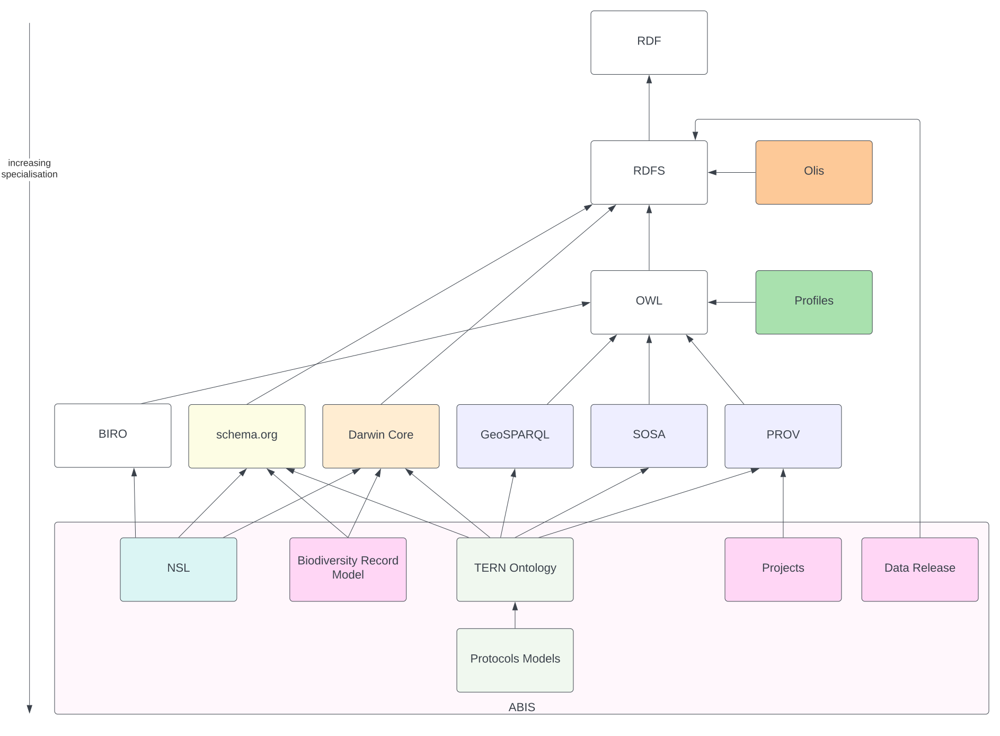

== Models

As per the <<Multiple Models, Multiple Models>> section within the <<Introduction, Introduction>>, ABIS is a set of models. The models have different roles and a dependency hierarchy.

=== Model Roles

The roles played by the various models within ABIS are:

* <<Foreground Model, Foreground Model>>
** The main model that is the union of its Foreground Models
* <<Foreground Models, Foreground Models>>
** Parts of the Foreground Model that may be used independently
* <<Background Models, Background Models>>
** Models that Foreground Models profile

=== Model Dependency Hierarchy

The dependency hierarchy indicates which models profile other models and thus are dependent on them. The mechanism of profiling are as per the <<PROF, Profiles Vocabulary>> but can easily be summarised as:

[verse,Profiles Vocabulary]
Any data which conforms to a model _MUST_ conform to any models it profiles

In practice this means that any model profiling any other may use elements from that profiled model but must not break any rules imposed on that element's use by the profiled model. These rules usually take the forms of required predicates and values for instances of particular classes, categorisation of object with terms from vocabularies and so on.

The following figure depicts the profiling relationships between the various models within ABIS.

[#hierarchy,link="img/hierarchy.svg"]
.The profile hierarchy of the models within ABIS. All the arrows indicate dependency or, formally, https://www.w3.org/TR/dx-prof/#Property:isProfileOf[`prof:isProfileOf`] relationships between the models, shown as rectangles. The ABIS model itself is the union of the NSL Model, the TERN Ontology and the ABIS Foreground Models.

=== Foreground Model

The ABIS Foreground Model is the union of the Foreground Models listed in the next section. The dependencies of these models are shown in <<#hierarchy, Figure 13>>, above.

When modelling biodiversity observations - ABIS' main concern - ABIS uses the <<TERNOntology, TERN Ontology>> for the scientific domain information. When modelling taxonomic name objects, ABIS uses the <<NSLM, NSL Model>>. When data packaging is necissary, the <<Record Model, Record Model>> is used.

=== Foreground Models

The Foreground Models of ABIS are:

. <<TERN Ontology, TERN Ontology>>
. <<NSL Model, NSL Model>>
. <<Record Model, Record Model>>

The TERN Ontology and the NSL Model are defined externally to ABIS whereas the other 3 are defined here, within the ABIS Specification. A short overview of each of these models follows.

==== TERN Ontology

Model location: see <<TERNOntology, TERN Ontology>> reference

===== Overview

The <<TERNOntology, TERN Ontology>> is a re-skinned, and slightly extended, version of the <<SOSA, Sensor, Observations, Sampling & Actuation (SOSA) ontology>> aiming to better cater for the biodiversity community. It is maintained by https://www.tern.org.au[TERN] and used beyond just ABIS.

The main patterns within the TERN Ontology are for _observations_ and _sampling_.

The _observations_ pattern is inherited directly from SOSA with some small extensions to indicate biodiversity and field observation objects, such as `Site`, and is essentially as per the following figure.

[#tern-sosa,link="img/tern-sosa.svg"]
.Classes and predicates from the <<SOSA, SOSA ontology>> used directly or subclassed with the same names by the <<TERNOntology, TERN Ontology>>.
image::img/tern-sosa.svg[TERN's Observation pattern,align="center",width=650]

This pattern sees instances of the class `Observation` - individual acts of a person or a sensor observing something - following procedures to quantify properties of a `Feature Of Interest` which could be a surveyed site, a material sample or even a satellite image (which would, in turn, be a sample of the land imaged). `Observation` instances produce `Result` instances which contain categorisations, numerical values, units of measure and so on, as necessary to well characterise the observed property quantity or category.

The <<PROV, Provenance Ontology>> offers a generic perspective on _observation_ and _sampling_ with its take on the _observation_ pattern above given in the figure below. This is as per the <<Provenance, Provenance Pattern>> described in the <<Patterns, Patterns Section>>.

[#tern-prov,link="img/tern-prov.svg"]
.The <<PROV, PROV>> perspective on the classes and predicates in the <<#tern-sosa, TERN Ontology's Observation pattern>>
image::img/tern-prov.svg[PROV interpretation of observation,align="center",width=550]

The TERN Ontology's _sampling_ pattern follows SOSA too but uses specialised classes for `Site`, `Survey` and other things familiar to those who have undertaken biodiversity surveys in the field. The general pattern is as the figure below.

[#tern-samping,link="img/tern-sampling.svg"]
.Classes and predicates within the <<TERNOntology, TERN Ontology>> used to characterise sampling. The `is sample of` predicate can be derived from relations between a `Sample`, the `Sampling` and the `Site`. Note the similarity of structure to the <<#tern-sosa, SOSA Observation pattern>>.
image::img/tern-sampling.svg[TERN's Observation pattern,align="center",width=650]

TERN Ontology data is packaged into instances of the TERN Ontology's https://linkeddata.tern.org.au/viewers/tern-ontology?resource=https://w3id.org/tern/ontologies/tern/RDFDataset[`tern:RDFDataset`] class which is analogous to the <<Record Model, Record Model>>'s `Dataset` class.

TERN Ontology data is logically grouped into instances of the Schema.org's https://schema.org/Dataset[`schema:Dataset`] class which is analogous to the <<Record Model, Record Model>>'s `Dataset` class.

[NOTE]
====
While the TERN Ontology provides some handling of data packaging, the Record Model provides a more extended form of packaging with catalogues of datasets of records. See the <<Data Cataloguing, Data Cataloguing>> pattern for more information.
====

===== Use in ABIS

The TERN Ontology provides the main model elements for ABIS observation-centric data. The other ABIS foreground models support this, covering off on aspects of ABIS data beyond the TERN Ontology's scope.

===== Examples

See <<C.1. TERN Ontology, Annex D: Extended Examples > TERN Ontology>> for a full example of TERN Ontology data with explanations for each part.

Also see the https://resources.bdr.gov.au/[BDR ABIS Resources] for multiple examples that can be loaded and validated using the online validators available there.

===== Further Information
Further details of the TERN Ontology's classes, predicates and patterns of expected use are documented at:

* https://linkeddata.tern.org.au/information-models/overview

==== NSL Model

Model location: see <<NSLM, NSL Model>> reference

===== Overview

The NSL Model is the https://biodiversity.org.au/nsl/[Australian National Species List] model for the identifying and referencing of species names.

An overview of the main classes and predicates of the NSL Model is given in the figure below.

[#nsl-model-overview,link="img/nsl-model-overview.svg"]
.An overview of the National Species List (NSL) model in Semantic Web form, adapted from that model's documentation online at https://linked.data.gov.au/def/nsl

The NSL Model associates the class https://kurrawong.github.io/nsl-model/spec.html#Taxon[`Taxon`] representing "A group of organisms considered by taxonomists to form a homogeneous unit" with names for them - https://kurrawong.github.io/nsl-model/spec.html#TaxonName[`Taxon Name`] - and usage of that name in literature - instances of the class https://kurrawong.github.io/nsl-model/spec.html#Usage[`Usage`], which is a special type of http://www.sparontologies.net/ontologies/biro[`BibliographicReference`] that quotes the `Taxon Name` as used in a https://schema.org/CreativeWork[`CreativeWork`]. It also allows the citation of `Usage` instances bu other `Usage` instances.

The join point between the NSL Model and the TERN Ontology is on the `Result` of an `Observation` being the assignment of a `Taxon Name` to a `Feature of Interest` (probably a `Sample`) as per the figure below:

[#nsl-join,link="img/nsl-model-overview.svg"]
.An overview of the National Species List (NSL) model in Semantic Web form, adapted from that model's documentation online at https://linked.data.gov.au/def/nsl
image::img/nsl-join.svg[NSL Model Overview,align="center",width=550]

[NOTE]
====
The NSL Model stated that a `Taxon`, rather than a `Taxon Name`, _MAY_ be assigned to a `Feature of Interest`, but it sets criteria for this in its https://linked.data.gov.au/def/nsl#mapping-abis[ABIS Mapping] section.
====

===== Use in ABIS

The NSL Model is used to link names for species to actual taxa and references to names and taxa in scientific literature.

ABIS data need only reference NSL data modelled according to the NSL Model and _SHOULD NOT_ re-characterise taxonomic name / taxon relations.

===== Examples

The entire NSL dataset, modelled according to the NSL Model, should be available for public access in the latter half of 2024. Additionally, the BDR will contain a copy of the NSL data, so access to the BDR should provide access to that.

Examples of NSL Model data can also be found throughout the https://linked.data.gov.au/def/nsl[NSL Model Specification].

References to NSL objects - instances of the `TaxonName` class - are also present within example data files in the https://abis.dev.kurrawong.ai[BDR ABIS Resources].

==== Record Model

Model location: <<#annex-a, Annex A>>

===== Overview

ABIS implements a simple and generic model for grouping Semantic Web that are the results of observations into catalogued objects and for linking data to records about them in non-Semantic Web form. This cataloguing model implements no novel classes or predicates and takes all of its elements from the widely used <<SDO, schema.org>> and the fundamental Semantic Web model <<RDFSPEC, RDFS>>.

[#brd-overview2,link="img/annex-a/rm-overview.svg"]
.An overview of ABIS' Record Model's classes and their relationships
image::img/annex-a/rm-overview.svg[Record Model overview,align="center",width=275]

See the patterns of <<Data Cataloguing, Data Cataloguing>> and <<Records & Occurrences>> for more information and <<#annex-a, this model's definition in Annex A>> for further information.

===== Use in ABIS

This model is the primary cataloguing model used in ABIS and also the model which connects ABIS objects to their non-Semantic Web, likely original, form. Thus it is a data model that assists with data management and provenance.

[NOTE]
====
<<schema:Statement, schema:Statement>> instances - the 'records' of this model - can often be inferred from ABIS data about things such as `<<#_darwin_core_terms, dwc:Occurrence>>` that do not directly state them according to the Record Rule - see the <<Rule List, Rule List>>, but the inference may be trivial in that the record may not contain useful information about it's non-ABIS form, such as original catalogue IDs.
====

[NOTE]
====
If an object is catalogues in more than one place, this model's mechanism for associating an ABIS representation of it with those non-Semantic Web representations may be use to record all the cataloguings, see the examples below.
====

===== Examples

====== Simple Example

[source,turtle]
----
ex:dataset-x
    a schema:Dataset ;
    # ... dataset metadata
.

ex:occurrence-y
    a dwc:Occurrence ;
    schema:isPartOf ex:dataset-x ;
    # ... other occurrence info
.

ex:occurrence-z
    a dwc:Occurrence ;
    schema:isPartOf ex:dataset-x ;
    # ... other occurrence info
.

ex:record-m
    a schema:Statement ;
    schema:about ex:occurrence-y ;
    schema:identifier "CR-1234"^^datatypes:acmeCatId ;
.

ex:record-n
    a schema:Statement ;
    schema:about ex:occurrence-z ;
    schema:identifier "CR-5678"^^datatypes:acmeCatId ;
.
----

In the example above, we have `<<_darwin_core_terms, dwc:Occurrence>>` instances, `ex:occurrence-y` & `ex:occurrence-z` which are part of a dataset, `ex:dataset-x`, and for which we have a <<schema:Statement, schema:Statement>> each that contains an _ACME Catalogue ID_, `datatypes:acmeCatId` for each one, linking them to a system that uses such IDs.

====== Multiple Cataloguings

[source,turtle]
----
ex:sample-x
    a dwc:Occurrence ;
    schema:isPartOf ex:dataset-x ;
    # ... other occurrence info
.

ex:record-m
    a schema:Statement ;
    schema:about ex:occurrence-y ;
    schema:identifier
        "SS-1234"^^datatypes:acmeCatId ,
        "fa801030-56d4-4d6d-8452-2696929bdea9"^^datatypes:museumZId ;
.
----

In the example above, the sample `ex:sample-x` is listed in two catalogues, once with an identifier of `SS-1234` and another with identifier `fa801030-56d4-4d6d-8452-2696929bdea9`.

To know which catalogues used these identifiers, the objects `datatypes:acmeCatId` & `datatypes:museumZId` will need to be resolved. See the <<#_identifiers, Identifiers Pattern Section>> for more on how identifiers of this form work, in particular the Alternate IDs - non-IRIs subsection.

See <<#_a_3_classes, Annex A's Class Listing>> for mode examples, per Record Model class.

=== Background Models

The Background Models within ABIS are all those profiled by the Foreground Models. They are shown visually in the <<#hierarchy, Model Dependency Hierarchy>>, above.

The main Background Models for ABIS are:

* <<DWC, Darwin Core>> - specialised properties for biodiversity modelling
* <<SOSA, Sensor, Observations, Sampling & Actuation (SOSA) ontology>> - sampling, observation & results modelling
* <<GSP, GeoSPARQL>> - for spatial object modelling
* <<PROV, Provenance Ontology (PROV)>> - for the lineage and attribution of data
* <<SDO, schema.org>> - for general-purpose attributes like names, dates, simple metadata etc.
* <<BIRO, Bibliographic Reference Ontology (BiRO)>> - for the description of reference lists and bibliographic references themselves

Of these models, all provide Semantic Web rules that can be used for data validation except for Darwin Core. Validators for each of these models, other than Darwin Core, are given in the <<Validation, Validation Section>>. These validators may be used individually or combined, within the ABIS Validator.

These models in turn profile several fundamental Semantic Web models:

* <<OWL2, OWL>>
* <<RDFSSPEC, RDF Schema>>
* <<RDFSPEC, RDF>>

Neither these models nor ABIS provide validators, however syntactic and some semantic data validation for RDF, RDFS & OWL data is built in to many Semantic Web / Linked Data tooling and, for example, syntactically invalid RDF data will not be able to be processed by ABIS other validators.

Additional Background Models - <<PROF, the Profiles Vocabulary>> & <<OLIS, Olis>> - are used to describe the relationships between ABIS models and between units of ABIS data within datasets, respectively, and do not need to be directly considered by users of ABIS: their impact is felt within the descriptions of this specification document itself.

Specific details of all these Background Models are not directly given here, other than certain patterns they impose and these are presented in the <<Patterns, Patterns Section>>.
