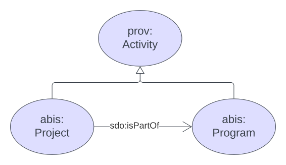
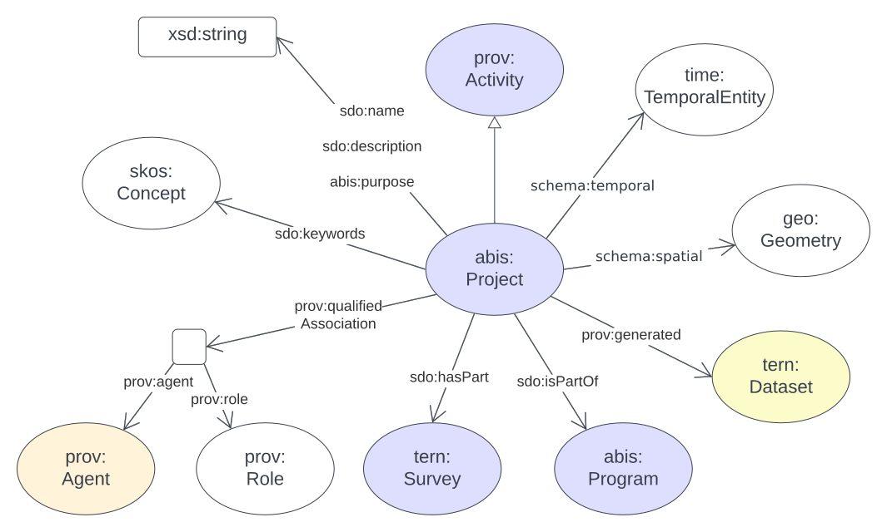
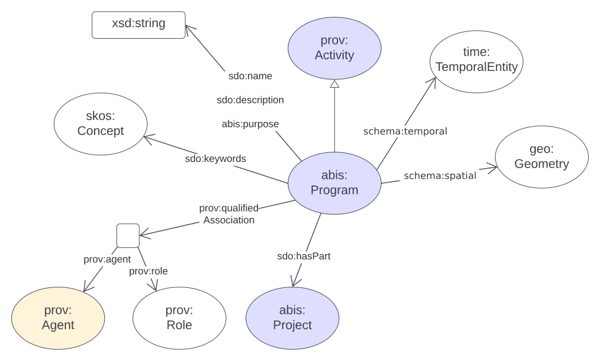

[[annex-a]]
== Annex A: Projects Model

[#proj-overview,link="img/proj-hierarchy.svg"]
.The two classes defined by the Projects Model - Project & Program - and their main relationships.

<<abis:Project, `Project`>>s are part of <<abis:Program, `Program`>>s and both are specialised forms of <<PROV, PROV>>'s https://www.w3.org/TR/prov-o/#Activity[`Activity`] class. An `Activity` is "something that occurs over a period of time and acts upon or with entities" which means `Project`s & `Program`s can have all the properties that `Activities` can have, such as temporal extents, `Agents` that have causal relationships to them and so on.

[[projects-metadata]]
=== Metadata

[frame=none, grid=none, cols="1,5"]
|===
|*<<IRI, IRI>>* | https://linked.data.gov.au/def/abis/projects
|*https://schema.org/name[Name]* | ABIS Data Release Model
|*https://www.w3.org/TR/skos-reference/#definition[Definition]* | This model is for describing Projects where Project is defined as "An Activity that requires concerted effort following a Plan in pursuit of an objective".
|*https://schema.org/dateCreated[Created Date]* | 2023-10-15
|*https://schema.org/dateModified[Modified Date]* | 2023-12-28
|*https://schema.org/dateIssued[Issued Date]* | 2023-12-28
|*https://schema.org/version[Version]* | 1.0
|*https://www.w3.org/TR/2012/REC-owl2-syntax-20121211/#Ontology_IRI_and_Version_IRI[Version IRI]* | https://linked.data.gov.au/def/abis/projects/1.0[abisp:1.0]
|*Version History*| *2.0* - 2023 Dec - First release (v2.0 to match ABIS)
|*https://schema.org/creator[Creator]* | the https://linked.data.gov.au/org/dcceew[Department of Climate Change, Energy and the Environment (DCCEEW)]
|*https://schema.org/owner[Owner]* | https://linked.data.gov.au/org/ausbigg[Australian Biodiversity Information Governance Group (AUSBIGG)]
|*https://schema.org/publisher[Publisher]* | https://linked.data.gov.au/org/dcceew[Department of Climate Change, Energy and the Environment (DCCEEW)]
|*https://schema.org/license[License]* | https://creativecommons.org/licenses/by/4.0/[Creative Commons Attribution 4.0 International (CC BY 4.0)]
|*https://www.w3.org/TR/vocab-dcat/#Property:resource_contact_point[Contacts]* | AusBIGG is supported by DCCEEW's' Biodiversity Data Repository (BDR) Team. Contact the BDR Team on bdr@dcceew.gov.au +
Issue tracking of the ABIS standard is managed online at https://github.com/AusBIGG/abis/issues
|*https://schema.org/codeRepository[Code Repository]* | https://github.com/AusBIGG/abis
|===

=== Supporting Assets

* RDF schema:
** https://linked.data.gov.au/def/abis/projects.ttl
* <<SHACL, SHACL>> validation file:
** https://linked.data.gov.au/def/abis/projects/validator.ttl

=== Classes

[discrete]
==== Class Index

Classes defined here:

* <<abis:Project, Project>>
* <<abis:Program, Program>>

Classes defined elsewhere:

* <<prov:Attribution, Attribution>>
* <<prov:Agent, Agent>>
* <<sdo:Organization, Organization>>
* <<sdo:Person, Person>>

[discrete]
[[abis:Project]]
==== Project

[#proj-project,link="img/proj-project.svg"]
.The Projects Model `Project` Class and its expected predicates

[cols="3,10"]
|===
| Property | Value

| <<IRI, IRI>> | `abis:Project`
| https://www.w3.org/TR/rdf12-schema/#ch_subclassof[Subclass of] | https://www.w3.org/TR/prov-o/#Activity[`Activity`]
| https://www.w3.org/TR/rdf12-schema/#ch_isdefinedby[Is Defined By] | This model
| https://www.w3.org/TR/skos-reference/#prefLabel[Preferred Label] | Project
| https://www.w3.org/TR/skos-reference/#definition[Definition] | An Activity that requires concerted effort following a Plan in pursuit of an objective
| https://www.w3.org/TR/skos-reference/#definition[History Note] | Defined by BDR Team in 2023 in response to BDR usage needs
| Expected Properties | <<sdo:isPartOf, is part of>>, <<time:hasTime, has time>>, <<geo:hasGeometry, has geometry>>, <<prov:generated, generated>>,
| https://www.w3.org/TR/skos-reference/#example[Example]
a|
----
:project-m
    a abis:Project ;
    sdo:name "Project M" ;
    sdo:description "South Australian government Project M-23" ;
    abis:purpose "To determine extent of koala populations in NE SA" ;
    sdo:keywords
        ex:koala ,
        <https://linked.data.gov.au/dataset/asgsed3/STE/4> ;   # S.A.
    sdo:isPartOf :program-n ;
    # Note TIME/PROV at https://www.w3.org/TR/owl-time/#time-prov
    # Note temporal range within that of containing Program
    prov:startedAtTime "2023-12-01"^^xsd:date ;
    prov:endedAtTime "2023-12-15"^^xsd:date ;
    geo:hasGeometry [
        a geo:Geometry ;
        geo:asWKT "POLYGON ((138.010254 -26.007424, 140.976563 -25.99755, ..., 138.010254 -26.007424))"
    ] ;
    prov:qualifiedAttribution [
        prov:agent ex:dewr ;  # SA Dept Env, e.g. only
        prov:hadRole role:principalInvestigator ;
    ] ;
    prov:generated ex:dataset-x ;
.

:program-n
    a abis:Program ;
    sdo:name "Program N" ;
    sdo:hasPart :project-m ;
    # Note TIME/PROV at https://www.w3.org/TR/owl-time/#time-prov
    time:hasTime [
        time:hasBeginning [
            time:inXSDDateTime "2023-12-01"^^xsd:date ;
        ] ;
        time:hasEnd [
            time:inXSDDateTime "2023-12-28"^^xsd:date ;
        ] ;
    ] ;
    # ... other properties
.
----
|===

[discrete]
[[abis:Program]]
==== Program

[#proj-program,link="img/proj-program.svg"]
.The Projects Model `Program` Class and its expected predicates

[cols="3,10"]
|===
| Property | Value

| <<IRI, IRI>> | `abis:Project`
| https://www.w3.org/TR/rdf12-schema/#ch_subclassof[Subclass of] | https://www.w3.org/TR/prov-o/#Activity[`Activity`]
| https://www.w3.org/TR/rdf12-schema/#ch_isdefinedby[Is Defined By] | This model
| https://www.w3.org/TR/skos-reference/#prefLabel[Preferred Label] | Project
| https://www.w3.org/TR/skos-reference/#definition[Definition] | An Activity that requires concerted effort following a Plan in pursuit of an objective
| https://www.w3.org/TR/skos-reference/#definition[History Note] | Defined by BDR Team in 2023 in response to BDR usage needs
| Expected Properties | <<sdo:hasPart, has part>> and all the properties of <<abis:Project, Project>>, other than <<sdo:isPartOf, is part of>>
| https://www.w3.org/TR/skos-reference/#example[Example] a| See the example for <<abis:Project, Project>>
|===

[discrete]
[[prov:Attribution]]
==== Attribution

[cols="3,10"]
|===
| Property | Value

| <<IRI, IRI>> | `prov:Attribution`
| https://www.w3.org/TR/skos-reference/#prefLabel[Preferred Label] | Attribution
| https://www.w3.org/TR/skos-reference/#definition[Definition] | The ascribing of an entity to an agent
| https://www.w3.org/TR/skos-reference/#scopeNote[Scope Note] | Use objects of this class to link <<abis:Project, Project>> or <<abis:Program, Program>> objects to <<prov:Agent, Agent>> objects and the roles they played with respect to the Activity
| https://www.w3.org/TR/rdf12-schema/#ch_isdefinedby[Is Defined By] | <<PROV, PROV>>
| Expected Properties | <<prov:agent, agent>>, <<prov:hadRole, had role>>
| https://www.w3.org/TR/skos-reference/#example[Example] a| See the Example for <<abis:Project, Project>>: the range value for the `prov:agent` predicate of the `Dataset`
|===

[discrete]
[[prov:Agent]]
==== Agent

[cols="3,10"]
|===
| Property | Value

| <<IRI, IRI>> | `prov:Agent`
| https://www.w3.org/TR/skos-reference/#prefLabel[Preferred Label] | Agent
| https://www.w3.org/TR/skos-reference/#definition[Definition] | Something that bears some form of responsibility for an activity taking place
| https://www.w3.org/TR/skos-reference/#scopeNote[Scope Note] | Use specialised objects of this class - Organisation or Person - that bear some form of responsibility for a <<abis:Project, Project>> where their role is qualified within a <<prov:Attribution, Attribution>>
| https://www.w3.org/TR/rdf12-schema/#ch_isdefinedby[Is Defined By] | <<PROV, PROV>>
| Expected Properties | None: use the Agent's identifier only
| https://www.w3.org/TR/skos-reference/#example[Example] a| See the Example for <<abis:Project, Project>>
|===

[discrete]
[[sdo:Organization]]
==== Organization

[cols="3,10"]
|===
| Property | Value

| <<IRI, IRI>> | `abis:Project`
| https://www.w3.org/TR/rdf12-schema/#ch_subclassof[Subclass of] | https://www.w3.org/TR/prov-o/#Activity[`Activity`]
| https://www.w3.org/TR/rdf12-schema/#ch_isdefinedby[Is Defined By] | This model
| https://www.w3.org/TR/skos-reference/#prefLabel[Preferred Label] | Project
| https://www.w3.org/TR/skos-reference/#definition[Definition] | An organization such as a school, NGO, corporation, club, etc.
| https://www.w3.org/TR/skos-reference/#definition[History Note] | Defined by <<SDO, schema.org>>
| Expected Properties |
| https://www.w3.org/TR/skos-reference/#example[Example] | See the Example for <<abis:Project, Project>>
|===

[discrete]
[discrete]
[[sdo:Person]]
==== Person

[cols="3,10"]
|===
| Property | Value

| <<IRI, IRI>> | `prov:Agent`
| https://www.w3.org/TR/skos-reference/#prefLabel[Preferred Label] | Agent
| https://www.w3.org/TR/skos-reference/#definition[Definition] | Something that bears some form of responsibility for an activity taking place
| https://www.w3.org/TR/skos-reference/#scopeNote[Scope Note] | Use specialised objects of this class - Organisation or Person - that bear some form of responsibility for a <<abis:Project, Project>> where their role is qualified within a <<prov:Attribution, Attribution>>
| https://www.w3.org/TR/rdf12-schema/#ch_isdefinedby[Is Defined By] | <<PROV, PROV>>
| Expected Properties | None: use the Agent's identifier only
| https://www.w3.org/TR/skos-reference/#example[Example] a| See the Example for <<abis:Project, Project>>
|===

[discrete]
[[skos:Concept]]
==== Concept

[cols="3,10"]
|===
| Property | Value

| <<IRI, IRI>> | `skos:Concept`
| https://www.w3.org/TR/skos-reference/#prefLabel[Preferred Label] | Concept
| https://www.w3.org/TR/skos-reference/#definition[Definition] | An idea or notion; a unit of thought
| https://www.w3.org/TR/skos-reference/#scopeNote[Scope Note] | Direct use of this Class is not expected, instead where a `Concept` is indicated for use, a specific concept from a controlled vocabulary is expected to be used.
| https://www.w3.org/TR/rdf12-schema/#ch_isdefinedby[Is Defined By] | <<SKOS, SKOS>>
| Expected Properties | None
|===

=== Predicates

This model defines only one predicate - <<abis:purpose, purpose>> - but also requires the use of others defined elsewhere. Definitions for all predicates are copied from source and given here.

[discrete]
==== Predicate Index

Predicates defined here:

* <<abis:purpose, purpose>>

Predicates defined elsewhere:

* <<sdo:name, name>>
* <<sdo:description, description>>
* <<sdo:keywords, keywords>>
* <<sdo:hasPart, has part>>
* <<sdo:isPartOf, is part of>>
* <<time:hasTime, has time>>
* <<geo:hasGeometry, has geometry>>
* <<prov:qualifiedAttribution, qualified attribution>>
* <<prov:agent, agent>>
* <<prov:hadRole, had role>>
* <<prov:generated, generated>>

[discrete]
[[abis:purpose]]
==== purpose

[cols="3,10"]
|===
| Property | Value

| <<IRI, IRI>> | `abis:purpose`
| https://www.w3.org/TR/skos-reference/#prefLabel[Preferred Label] | purpose
| https://www.w3.org/TR/skos-reference/#definition[Definition] | The intent of the Activity
| https://www.w3.org/TR/skos-reference/#scopeNote[Scope Note] | Use this predicate to indicate a textual intent for a Project or a Program
| https://www.w3.org/TR/rdf12-schema/#ch_isdefinedby[Is Defined By] | This model
| https://www.w3.org/TR/skos-reference/#example[Example] a| See the example for <<abis:Project, Project>>
|===

[discrete]
[[sdo:name]]
==== name

[cols="3,10"]
|===
| Property | Value

| <<IRI, IRI>> | `sdo:name`
| https://www.w3.org/TR/skos-reference/#prefLabel[Preferred Label] | name
| https://www.w3.org/TR/skos-reference/#definition[Definition] | The name of the item
| https://www.w3.org/TR/skos-reference/#scopeNote[Scope Note] | Use this predicate to indicate a textual name for something
| https://www.w3.org/TR/rdf12-schema/#ch_isdefinedby[Is Defined By] | <<SDO, SDO>>
| https://www.w3.org/TR/skos-reference/#example[Example] a| See the example for <<abis:Project, Project>>
|===

[discrete]
[[sdo:description]]
==== description

[cols="3,10"]
|===
| Property | Value

| <<IRI, IRI>> | `sdo:description`
| https://www.w3.org/TR/skos-reference/#prefLabel[Preferred Label] | description
| https://www.w3.org/TR/skos-reference/#definition[Definition] | A description of the item
| https://www.w3.org/TR/skos-reference/#scopeNote[Scope Note] | Use this predicate to indicate a textual description for something
| https://www.w3.org/TR/rdf12-schema/#ch_isdefinedby[Is Defined By] | <<SDO, SDO>>
| https://www.w3.org/TR/skos-reference/#example[Example] a| See the example for <<abis:Project, Project>>
|===

[discrete]
[[sdo:keywords]]
==== keywords

[cols="3,10"]
|===
| Property | Value

| <<IRI, IRI>> | `sdo:keywords`
| https://www.w3.org/TR/skos-reference/#prefLabel[Preferred Label] | keywords
| https://www.w3.org/TR/skos-reference/#definition[Definition] | Keywords or tags used to describe some item
| https://www.w3.org/TR/skos-reference/#scopeNote[Scope Note] | Use this predicate to indicate <<skos:Concept, Concept>> instances from controlled vocabularies to categorise the object this predicate is applied to
| https://www.w3.org/TR/rdf12-schema/#ch_isdefinedby[Is Defined By] | <<SDO, SDO>>
| https://www.w3.org/TR/skos-reference/#example[Example] a| See the Example for <<abis:Project, Project>>
|===

[discrete]
[[sdo:hasPart]]
==== has part

[cols="3,10"]
|===
| Property | Value

| <<IRI, IRI>> | `sdo:hasPart`
| https://www.w3.org/TR/skos-reference/#prefLabel[Preferred Label] | has part
| https://www.w3.org/TR/skos-reference/#definition[Definition] | Indicates an item is part of this item
| Inverse of | <<sdo:isPartOf, is part of>>
| https://www.w3.org/TR/skos-reference/#scopeNote[Scope Note] | Use this predicate to indicate that a <<abis:Program, Program>> includes a See the example for <<abis:Project, Project>>
| https://www.w3.org/TR/rdf12-schema/#ch_isdefinedby[Is Defined By] | <<SDO, SDO>>
| https://www.w3.org/TR/skos-reference/#example[Example] a| See the example for <<abis:Project, Project>>
|===

[discrete]
[[sdo:isPartOf]]
==== is part of

[cols="3,10"]
|===
| Property | Value

| <<IRI, IRI>> | `sdo:isPartOf`
| https://www.w3.org/TR/skos-reference/#prefLabel[Preferred Label] | is part of
| https://www.w3.org/TR/skos-reference/#definition[Definition] | Indicates an item that this item, in some sense, is part of
| Inverse of | <<sdo:hasPart, has part>>
| https://www.w3.org/TR/skos-reference/#scopeNote[Scope Note] | Use this predicate to indicate that a <<abis:Program, Program>> includes a See the example for <<abis:Project, Project>>
| https://www.w3.org/TR/rdf12-schema/#ch_isdefinedby[Is Defined By] | <<SDO, SDO>>
| https://www.w3.org/TR/skos-reference/#example[Example] a| See the example for <<abis:Project, Project>>
|===

[discrete]
[discrete]
[[time:hasTime]]
==== has time

[cols="3,10"]
|===
| Property | Value

| <<IRI, IRI>> | `time:hasTime`
| https://www.w3.org/TR/skos-reference/#prefLabel[Preferred Label] | has time
| https://www.w3.org/TR/skos-reference/#definition[Definition] | Supports the association of a temporal entity (instant or interval) to any thing
| https://www.w3.org/TR/skos-reference/#scopeNote[Scope Note] | Use this predicate to indicate that a <<abis:Program, Program>> or a <<abis:Project, Project>> has a temporal region of concern
| https://www.w3.org/TR/rdf12-schema/#ch_isdefinedby[Is Defined By] | <<TIME, OWL TIME>>
| https://www.w3.org/TR/skos-reference/#example[Example] a| See the example for <<abis:Project, Project>>
|===

[discrete]
[[geo:hasGeometry]]
==== hasGeometry

[cols="3,10"]
|===
| Property | Value

| <<IRI, IRI>> | `geo:hasGeometry`
| https://www.w3.org/TR/skos-reference/#prefLabel[Preferred Label] | is part of
| https://www.w3.org/TR/skos-reference/#definition[Definition] | A spatial representation for a given Feature
| https://www.w3.org/TR/skos-reference/#scopeNote[Scope Note] | Use this predicate to indicate that a <<abis:Program, Program>> or a <<abis:Project, Project>> has a spatial area of concern
| https://www.w3.org/TR/rdf12-schema/#ch_isdefinedby[Is Defined By] | <<GSP, GeoSPARQL>>
| Range  | https://opengeospatial.github.io/ogc-geosparql/geosparql11/spec.html#_geometry_class[`Geometry`]
| https://www.w3.org/TR/skos-reference/#example[Example] a| See the example for <<abis:Project, Project>>
|===

[discrete]
[[prov:qualifiedAttribution]]
==== qualified attribution

[cols="3,10"]
|===
| Property | Value

| <<IRI, IRI>> | `prov:qualifiedAttribution`
| https://www.w3.org/TR/skos-reference/#prefLabel[Preferred Label] | qualified attribution
| https://www.w3.org/TR/skos-reference/#definition[Definition] | The ascribing of an entity to an agent
| https://www.w3.org/TR/skos-reference/#scopeNote[Scope Note] | Use this predicate to link a <<abis:Project, Project>> or a <<abis:Program, Program>> to a <<prov:Attribution, Attribution>> which then links to an <<prov:Agent, Agent>>, which must be an Organization or a Person, and a <<skos:Concept, Concept>>
| https://www.w3.org/TR/rdf12-schema/#ch_isdefinedby[Is Defined By] | <<PROV, PROV>>
| https://www.w3.org/TR/skos-reference/#example[Example] a| See the example for <<abis:Project, Project>>
|===

[discrete]
[[prov:agent]]
==== agent

[cols="3,10"]
|===
| Property | Value

| <<IRI, IRI>> | `prov:agent`
| https://www.w3.org/TR/skos-reference/#prefLabel[Preferred Label] | agent
| https://www.w3.org/TR/skos-reference/#definition[Definition] | References an <<prov:Agent, Agent>> which influenced a resource
| https://www.w3.org/TR/skos-reference/#scopeNote[Scope Note] | Use this predicate to link an <<abis:Project, Project>> or a <<abis:Program, Program>> to an <<prov:Agent, Agent>>, which must be an Organization or a Person
| https://www.w3.org/TR/rdf12-schema/#ch_isdefinedby[Is Defined By] | <<PROV, PROV>>
| https://www.w3.org/TR/skos-reference/#example[Example] a| See the example for <<abis:Project, Project>>
|===

[discrete]
[[prov:hadRole]]
==== had role

[cols="3,10"]
|===
| Property | Value

| <<IRI, IRI>> | `prov:hadRole`
| https://www.w3.org/TR/skos-reference/#prefLabel[Preferred Label] | had role
| https://www.w3.org/TR/skos-reference/#definition[Definition] | A role is the function of an entity or agent with respect to an activity
| https://www.w3.org/TR/skos-reference/#scopeNote[Scope Note] | Use this predicate to link an <<abis:Project, Project>> or a <<abis:Program, Program>> to a <<skos:Concept, Concept>>
| https://www.w3.org/TR/rdf12-schema/#ch_isdefinedby[Is Defined By] | <<PROV, PROV>>
| https://www.w3.org/TR/skos-reference/#example[Example] a| See the example for <<abis:Project, Project>>
|===

[discrete]
[[prov:generated]]
==== generated

[cols="3,10"]
|===
| Property | Value

| <<IRI, IRI>> | `prov:generated`
| https://www.w3.org/TR/skos-reference/#prefLabel[Preferred Label] | generated
| https://www.w3.org/TR/skos-reference/#definition[Definition] | Generation is the completion of production of a new entity by an activity
| https://www.w3.org/TR/skos-reference/#scopeNote[Scope Note] | Use this predicate to link a <<abis:Project, Project>> or a <<abis:Program, Program>> to data that it produced, in the form of an https://linkeddata.tern.org.au/viewers/tern-ontology?uri=https://w3id.org/tern/ontologies/tern/RDFDataset[`RDFDataset`] containing ABIS data
| https://www.w3.org/TR/rdf12-schema/#ch_isdefinedby[Is Defined By] | <<PROV, PROV>>
| https://www.w3.org/TR/skos-reference/#example[Example] a| See the example for <<abis:Project, Project>>
|===

=== Shapes

The following <<SHACL, SHACL>> shapes are graph patterns mandated by this model.

[discrete]
==== Shapes Index

* <<#idn-roles, IDN Roles>>

#INCOMPLETE#

[discrete]
[[idn-roles]]
==== IDN Roles

[cols="3,10"]
|===
| Property | Value

| <<IRI, IRI>> | `abis:idn-roles`
| https://www.w3.org/TR/skos-reference/#prefLabel[Preferred Label] | IDN Roles
| https://www.w3.org/TR/skos-reference/#definition[Definition] | Roles for the predicate `prov:role` on instances of `prov:Attribution` linked to an `abis:Project` must be taken from the https://data.idnau.org/pid/vocab/idn-role-codes[IDN Role Codes Vocabulary]
| https://www.w3.org/TR/rdf12-schema/#ch_isdefinedby[Is Defined By] | This model's validator
| Code a|
----
abis:idn-roles
    a shacl:Shape ;
    sdo:name "IDN Roles" ;
    sdo:description "Roles for the predicate prov:role on instances of prov:Attribution linked to an abis:Project must be taken from the IDN Role Codes Vocabulary (https://data.idnau.org/pid/vocab/idn-role-codes)" ;
    sh:path [

    ] ;
.
----
|===

#INCOMPLETE#