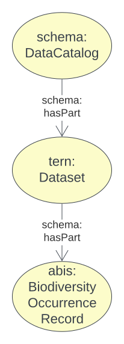
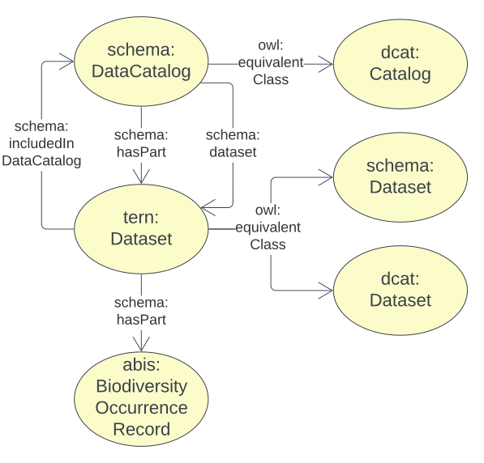

[[annex-a]]
== Annex A: ABIS Catalogue Model

[#cat-model-overview,link="img/cat-model.svg"]
.An overview of the ABIS Catalogue Model's classes and their relationships

<<schema:DataCatalog, DataCatalog>>s are curated lists of <<tern:Dataset, Dataset>>s that contain <<abis:BiodiversityOccurrenceRecord, Biodiversity Occurrence Record>>s (just 'Records').

The Dataset class is taken from the <<TERN Ontology, TERN Ontology>> and normal <<SDO, schema.org>> data catalogue modelling (informed by <<DCAT, DCAT>>) is used so that datasets are _creative work_ objects and may be described with metadata such as _creator_, _issued date_, etc.

The validator for this model, given in this model's <<A.5. Validator, Validator>> section, only check for minimal conformance to this model - correct use of the classes in relation to one another - and does not mandate any other properties for catalogues, datasets or records. Such validation is the role of _profiles_ of this model or of ABIS as a whole.

[NOTE]
====
See the <<BDR Profile, BDR Profile>> for the requirements of ABIS Catalogue Model data bound for the BDR.
====

[[catalogue-metadata]]
=== A.1. Metadata

[frame=none, grid=none, cols="1,5"]
|===
|*<<IRI, IRI>>* | https://linked.data.gov.au/def/abis/projects
|*https://schema.org/name[Name]* | ABIS Data Release Model
|*https://www.w3.org/TR/skos-reference/#definition[Definition]* | This model is for curated lists - catalogues - of data resources - datasets - that contains information about biodiversity occurrences - biodiversity occurrence records.
|*https://schema.org/dateCreated[Created Date]* | 2024-07-15
|*https://schema.org/dateModified[Modified Date]* | 2024-07-22
|*https://schema.org/dateIssued[Issued Date]* | 2023-07-30
|*https://schema.org/version[Version]* | 2.0
|*https://www.w3.org/TR/2012/REC-owl2-syntax-20121211/#Ontology_IRI_and_Version_IRI[Version IRI]* | https://linked.data.gov.au/def/abis/catalogue/1.0[abisc:1.0]
|*Version History*| *2.0* - 2024 July - First release (v2.0 to match ABIS)
|*https://schema.org/creator[Creator]* | https://linked.data.gov.au/org/dcceew[Department of Climate Change, Energy and the Environment (DCCEEW)]
|*https://schema.org/owner[Owner]* | https://linked.data.gov.au/org/ausbigg[Australian Biodiversity Information Governance Group (AUSBIGG)]
|*https://schema.org/publisher[Publisher]* | https://linked.data.gov.au/org/dcceew[Department of Climate Change, Energy and the Environment (DCCEEW)]
|*https://schema.org/license[License]* | https://creativecommons.org/licenses/by/4.0/[Creative Commons Attribution 4.0 International (CC BY 4.0)]
|*https://www.w3.org/TR/vocab-dcat/#Property:resource_contact_point[Contacts]* | AusBIGG is supported by DCCEEW's' Biodiversity Data Repository (BDR) Team. Contact the BDR Team on bdr@dcceew.gov.au +
Issue tracking of the ABIS standard is managed online at https://github.com/AusBIGG/abis/issues
|*https://schema.org/codeRepository[Code Repository]* | https://github.com/AusBIGG/abis
|===

=== A.2. Supporting Assets

* RDF schema:
** https://linked.data.gov.au/def/abis/catalogue.ttl
* <<SHACL, SHACL>> validation file:
** https://linked.data.gov.au/def/abis/catalogue/validator.ttl

=== A.3. Classes

[#cat-model-equivalences,link="img/cat-model-equivalences.svg"]
.Class equivalences between this ABIS Catalogue Model, <<SDO, schema.org>> and <<DCAT, DCAT>>

[discrete]
==== Class Index

Classes defined here:

* <<abis:BiodiversityOccurrenceRecord, Record>>

Classes defined elsewhere:

* <<schema:DataCatalog, DataCatalog>>
* <<tern:Dataset, Dataset>>
* <<dwc:Occurrence, Occurrence>>

[discrete]
[[abis:BiodiversityOccurrenceRecord]]
==== BiodiversityOccurrenceRecord (Record)

// [#proj-project,link="img/proj-project.svg"]
// .The Projects Model `Project` Class and its expected predicates
// image::img/proj-project.svg[Projects Model Project Class,align="center",width=650]

[cols="3,10"]
|===
| Property | Value

| <<IRI, IRI>> | `abis:BiodiversityOccurrenceRecord`
| https://www.w3.org/TR/rdf12-schema/#ch_subclassof[Subclass of] | https://www.w3.org/TR/prov-o/#Entity[`Entity`]
| https://www.w3.org/TR/rdf12-schema/#ch_isdefinedby[Is Defined By] | <<TERN Ontology, TERN Ontology>>
| https://www.w3.org/TR/skos-reference/#prefLabel[Preferred Label] | Dataset
| https://www.w3.org/TR/skos-reference/#definition[Definition] | A collection of data, published or curated by a single agent, and available for access or download in one or more representations.
// | https://www.w3.org/TR/skos-reference/#definition[History Note] | Defined by BDR Team in 2023 in response to BDR usage needs
| Expected Properties | <<schema:hasPart, has part>>
| https://www.w3.org/TR/skos-reference/#example[Example]
a|
----
:dataset-x
    a tern:Dataset ;
    schema:name "Dataset X" ;
    schema:description "A dummy dataset of biodiversity records - koalas in South Australia" ;
    schema:keywords
        ex:koala ,
        <https://linked.data.gov.au/dataset/asgsed3/STE/4> ;   # S.A.
    schema:contentLocation [
        a geo:Geometry ;
        geo:asWKT "POLYGON ((138.010254 -26.007424, 140.976563 -25.99755, ..., 138.010254 -26.007424))"
    ] ;
    prov:qualifiedAttribution [
        prov:agent ex:dewr ;  # SA Department for Environment & Water
        prov:hadRole role:author ;
    ] ;
    schema:isPartOf :catalogue-y ;
    schema:hasPart
        :record-001 ,
        :record-002 ,
        # many other records
        :record-NNN ;
.

:catalogue-y
    a schema:DataCatalog ;
    schema:name "Catalogue Y" ;
    schema:hasPart :dataset-x ;
    # ... other properties
.

:record-001
    a abis:BiodiversityOccurrenceRecord ;
    time:hasTime [
        time:inXSDDate "2024-07-15" ;
    ]
----
|===

[[schema:DataCatalog]]
==== Data Catalog

[[tern:Dataset]]
==== Dataset

[[dwc:Occurrence]]
==== Occurrence

=== A.4. Predicates

// This model defines only one predicate - <<abis:purpose, purpose>> - but also requires the use of others defined elsewhere. Definitions for all predicates are copied from source and given here.

[discrete]
==== Predicate Index

Predicates defined here:

* None

Predicates defined elsewhere:

* <<schema:about, schema:about>>

[discrete]
[[schema:about]]
==== about

[cols="3,10"]
|===
| Property | Value

| <<IRI, IRI>> | `abis:purpose`
| https://www.w3.org/TR/skos-reference/#prefLabel[Preferred Label] | purpose
| https://www.w3.org/TR/skos-reference/#definition[Definition] | The intent of the Activity
| https://www.w3.org/TR/skos-reference/#scopeNote[Scope Note] | Use this predicate to indicate a textual intent for a Project or a Program
| https://www.w3.org/TR/rdf12-schema/#ch_isdefinedby[Is Defined By] | This model
| https://www.w3.org/TR/skos-reference/#example[Example] a| See the example for <<abis:Project, Project>>
|===

=== A.5. Validator

The following <<SHACL, SHACL>> shapes are graph patterns mandated by this model.

[discrete]
==== Shapes Index

#INCOMPLETE#