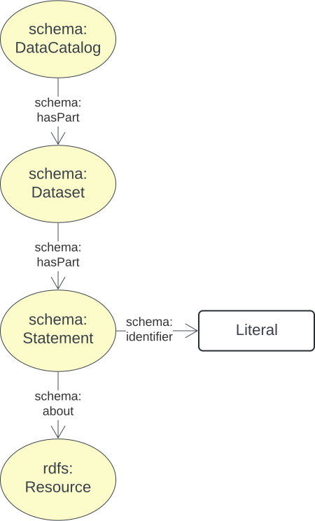
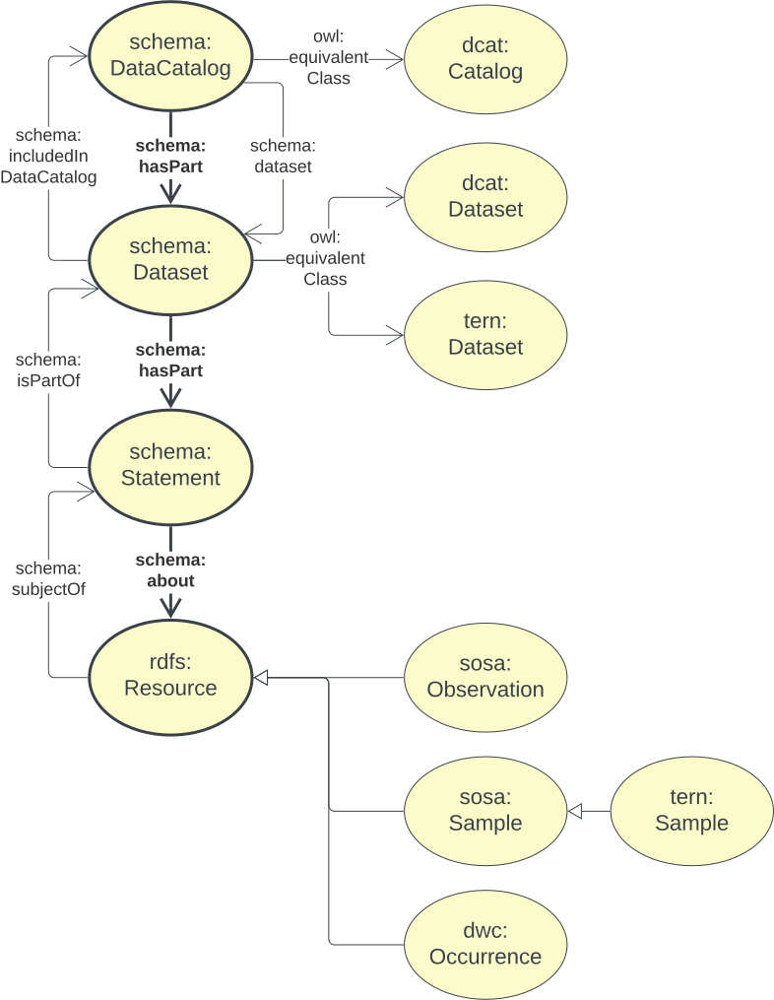
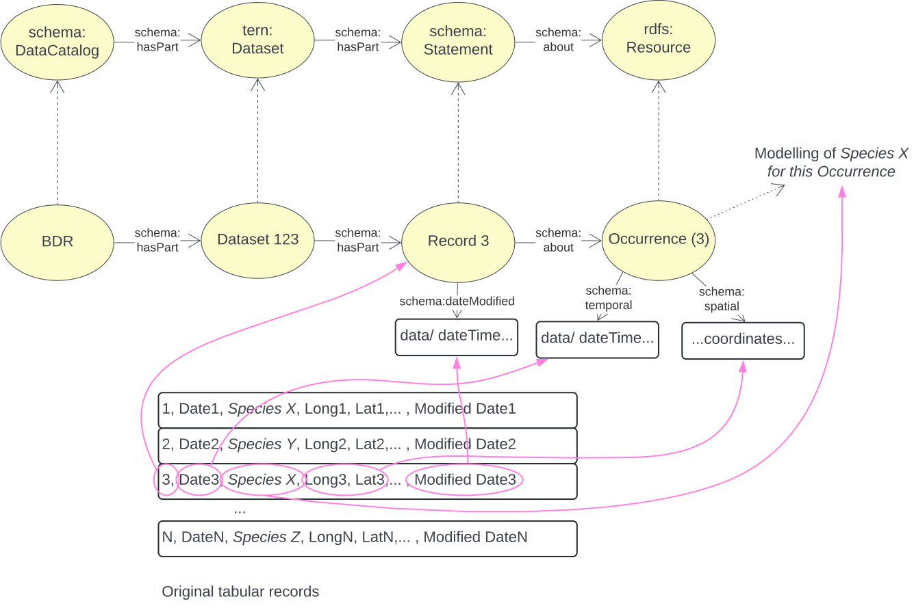

[[annex-a]]
== Annex A: Record Model

[#brd-overview,link="img/annex-a/rm-overview.svg"]
.An overview of ABIS' Record Model's classes and their relationships

This model links objects represented in Semantic Web data to records about them that preserve identifiers from their original non-Semantic Web form. This allows easy association of Semantic Web and non-Semantic Web forms and facilitates good provenance for data conversions to Semantic Web form.

This is an entirely generic model that can be used with any types of Semantic Web objects for which there are records about them containing non-Semantic Web native information, however in the context of ABIS, the Semantic Web objects are expected to be relevant to ABIS, such as https://dwc.tdwg.org/terms/#occurrence[`dwc:Occurrence`] instances or https://w3id.org/tern/ontologies/tern/Site[`tern:Site`] instances.

[NOTE]
====
No validators are supplied with this model so it is to be used as a pattern. Profiles of ABIS many and should supply validators that restrict the types of object that records should be allowed to be for.

See the <<BDR Profile, BDR Profile>> for the requirements of Record Model data bound for the Biodiversity Data Repository.
====

[[catalogue-metadata]]
=== A.1. Metadata

[frame=none, grid=none, cols="1,5"]
|===
|*<<IRI, IRI>>* | https://linked.data.gov.au/def/abis/brm
|*https://schema.org/name[Name]* | ABIS Record Model
|*https://www.w3.org/TR/skos-reference/#definition[Definition]* | This model is for curated lists - catalogues - of data resources - datasets - that contains information about biodiversity occurrences and surveys - biodiversity records.
|*https://schema.org/dateCreated[Created Date]* | 2024-07-15
|*https://schema.org/dateModified[Modified Date]* | 2025-07-26
|*https://schema.org/dateIssued[Issued Date]* | 2024-07-30
|*https://schema.org/version[Version]* | 2.0
|*https://www.w3.org/TR/2012/REC-owl2-syntax-20121211/#Ontology_IRI_and_Version_IRI[Version IRI]* | https://linked.data.gov.au/def/abis/catalogue/1.0[abisc:1.0]
|*Version History*| *2.0* - 2024 July - First release (v2.0 to match ABIS)
|*https://schema.org/creator[Creator]* | https://linked.data.gov.au/org/dcceew[Department of Climate Change, Energy and the Environment (DCCEEW)]
|*https://schema.org/owner[Owner]* | https://linked.data.gov.au/org/ausbigg[Australian Biodiversity Information Governance Group (AUSBIGG)]
|*https://schema.org/publisher[Publisher]* | https://linked.data.gov.au/org/dcceew[Department of Climate Change, Energy and the Environment (DCCEEW)]
|*https://schema.org/license[License]* | https://creativecommons.org/licenses/by/4.0/[Creative Commons Attribution 4.0 International (CC BY 4.0)]
|*https://www.w3.org/TR/vocab-dcat/#Property:resource_contact_point[Contacts]* | AusBIGG is supported by DCCEEW's' Biodiversity Data Repository (BDR) Team. Contact the BDR Team on bdr@dcceew.gov.au +
Issue tracking of the ABIS standard is managed online at https://github.com/AusBIGG/abis/issues
|*https://schema.org/codeRepository[Code Repository]* | https://github.com/AusBIGG/abis
|===

=== A.2. Supporting Assets

* RDF schema:
** https://linked.data.gov.au/def/abis/catalogue.ttl
* <<SHACL, SHACL>> validation file:
** https://linked.data.gov.au/def/abis/catalogue/validator.ttl

=== A.3. Classes

[discrete]
==== Class Index

Classes defined here:

* None

Classes defined elsewhere:

* <<schema:DataCatalog, DataCatalog>>
* <<schema:Dataset, Dataset>>
* <<schema:Statement, Statement>>
* <<rdfs:Resource, Resource>>

[discrete]
[[schema:DataCatalog]]
==== Data Catalog

See <<SDO, schema.org>>'s `DataCatalogue` class: https://schema.org/DataCatalogue

[discrete]
[[schema:Dataset]]
==== Dataset

See <<SDO, schema.org>>'s `Dataset` class: https://schema.org/Dataset

[discrete]
[[schema:Statement]]
==== Statement

See <<SDO, schema.org>>'s `Statement` class: https://schema.org/Statement and consider the following example of its use within this model:

----
:catalogue-x
    a schema:DataCatalog ;
    schema:name "Catalogue X" ;
    schema:hasPart :dataset-y ;
    # ... other catalogue metadata
.

:dataset-y
    a schema:Dataset ;
    schema:name "Dataset Y" ;
    # ... ther dataset metadata
    schema:isPartOf :catalogue-y ;
    schema:hasPart
        :record-001 ,
        :record-002 ,
        # ... many other records
        :record-NNN ;
.

:record-001
    a schema:Statement ;
    # a non-IRI identifier for this Record, as found in the original
    # data held by the Submitting Organisation
    schema:identifier "R1234"^^ex:OrgMRecordId ;
    # inverse of :dataset-y schema:hasPart :record-001
    schema:isPartOf :dataset-y ;
    # the thing the Record is about
    schema:about :occurrence-aaa ;
.

:occurrence-aaa
    a dwc:Occurrence ;
    schmea:name "Occurrence AAA" ;
    schema:additionalType <https://linked.data.gov.au/def/tern-cv/cd5cbdbb-07d9-4a5b-9b11-5ab9d6015be6> ;  # animal specimen
    sosa:isSampleOf :foi-h ;  # linke a field site
    sosa:usedProcedure :procedure-i ;  # a controlled method
    schema:spatial [ geo:asWKT "POINT (120.244 -32.959)"^^geo:wktLiteral ] ;
    schema:temporal "2014-07-23"^^xsd:date ;
.
----

[discrete]
[[rdfs:Resource]]
==== Resource

See <<RDFSPEC, RDFS>>'s `Resource` class: https://www.w3.org/TR/rdf11-schema/#ch_resource

=== A.4. Predicates

[discrete]
==== Predicate Index

Predicates defined here:

* None

Predicates defined elsewhere:

* <<schema:about, schema:about>>
* <<schema:identifier, schema:identifier>>
* <<schema:hasPart, schema:hasPart>>

[discrete]
[[schema:about]]
==== about

See <<SDO, schema.org>>'s `Dataset` predicate: https://schema.org/about

[discrete]
[[schema:identifier]]
==== about

See <<SDO, schema.org>>'s `Dataset` predicate: https://schema.org/identifier

[discrete]
[[schema:hasPart]]
==== hasPart

See <<SDO, schema.org>>'s `Dataset` predicate: https://schema.org/hasPart

=== A.5. Alignmentls

[#brm-join,link="img/annex-a/rm-join.svg"]
.Class equivalences between this Biodiversity Record Model, <<SDO, schema.org>> and <<DCAT, DCAT>>

[#brm-occurrence,link="img/annex-a/rm-occurrence.svg"]
.Biodiversity Record Model occurrence modelling
