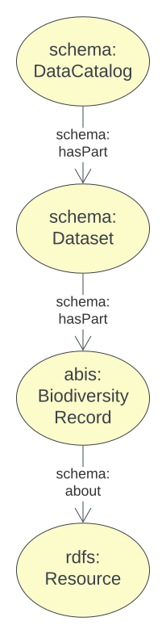
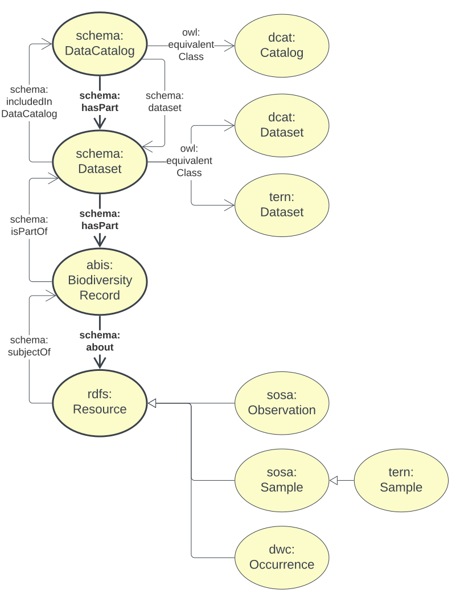
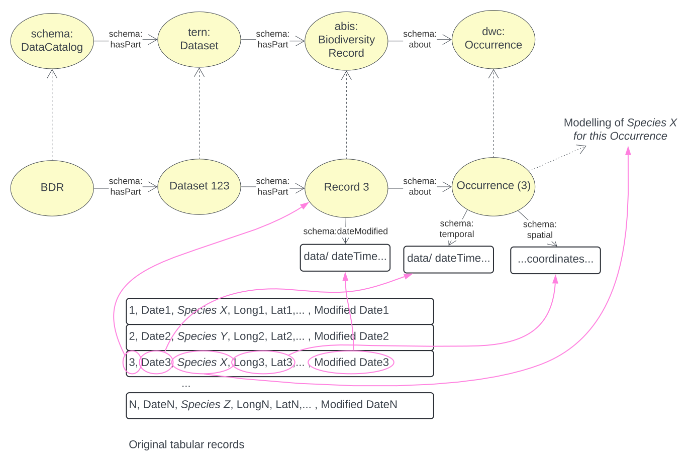

[[annex-a]]
== Annex A: Biodiversity Record Model

[#brd-overview,link="img/brm-overview.svg"]
.An overview of the Biodiversity Record Model's classes and their relationships

<<schema:DataCatalog, DataCatalog>>s are curated lists of <<tern:Dataset, Dataset>>s that contain <<abis:BiodiversityRecord, Biodiversity Record>>s (just 'Records').

The Dataset class is taken from the <<TERN Ontology, TERN Ontology>> and normal <<SDO, schema.org>> data catalogue modelling (informed by <<DCAT, DCAT>>) is used so that datasets are _creative work_ objects and may be described with metadata such as _creator_, _issued date_, etc.

The validator for this model, given in this model's <<A.5. Validator, Validator>> section, only check for minimal conformance to this model - correct use of the classes in relation to one another - and does not mandate any other properties for catalogues, datasets or records. Such validation is the role of _profiles_ of this model or of ABIS as a whole.

[NOTE]
====
See the <<BDR Profile, BDR Profile>> for the requirements of Biodiversity Record Model data bound for the BDR.
====

[#brm-join,link="img/brm-join.svg"]
.Class equivalences between this Biodiversity Record Model, <<SDO, schema.org>> and <<DCAT, DCAT>>

[#brm-occurrence,link="img/brm-occurrence.svg"]
.Biodiversity Record Model occurrence modelling

[[catalogue-metadata]]
=== A.1. Metadata

[frame=none, grid=none, cols="1,5"]
|===
|*<<IRI, IRI>>* | https://linked.data.gov.au/def/abis/projects
|*https://schema.org/name[Name]* | ABIS Data Release Model
|*https://www.w3.org/TR/skos-reference/#definition[Definition]* | This model is for curated lists - catalogues - of data resources - datasets - that contains information about biodiversity occurrences and surveys - biodiversity records.
|*https://schema.org/dateCreated[Created Date]* | 2024-07-15
|*https://schema.org/dateModified[Modified Date]* | 2024-07-22
|*https://schema.org/dateIssued[Issued Date]* | 2023-07-30
|*https://schema.org/version[Version]* | 2.0
|*https://www.w3.org/TR/2012/REC-owl2-syntax-20121211/#Ontology_IRI_and_Version_IRI[Version IRI]* | https://linked.data.gov.au/def/abis/catalogue/1.0[abisc:1.0]
|*Version History*| *2.0* - 2024 July - First release (v2.0 to match ABIS)
|*https://schema.org/creator[Creator]* | https://linked.data.gov.au/org/dcceew[Department of Climate Change, Energy and the Environment (DCCEEW)]
|*https://schema.org/owner[Owner]* | https://linked.data.gov.au/org/ausbigg[Australian Biodiversity Information Governance Group (AUSBIGG)]
|*https://schema.org/publisher[Publisher]* | https://linked.data.gov.au/org/dcceew[Department of Climate Change, Energy and the Environment (DCCEEW)]
|*https://schema.org/license[License]* | https://creativecommons.org/licenses/by/4.0/[Creative Commons Attribution 4.0 International (CC BY 4.0)]
|*https://www.w3.org/TR/vocab-dcat/#Property:resource_contact_point[Contacts]* | AusBIGG is supported by DCCEEW's' Biodiversity Data Repository (BDR) Team. Contact the BDR Team on bdr@dcceew.gov.au +
Issue tracking of the ABIS standard is managed online at https://github.com/AusBIGG/abis/issues
|*https://schema.org/codeRepository[Code Repository]* | https://github.com/AusBIGG/abis
|===

=== A.2. Supporting Assets

* RDF schema:
** https://linked.data.gov.au/def/abis/catalogue.ttl
* <<SHACL, SHACL>> validation file:
** https://linked.data.gov.au/def/abis/catalogue/validator.ttl

=== A.3. Classes

[discrete]
==== Class Index

Classes defined here:

* <<abis:BiodiversityRecord, Record>>

Classes defined elsewhere:

* <<schema:DataCatalog, DataCatalog>>
* <<tern:Dataset, Dataset>>
* <<dwc:Occurrence, Occurrence>>

[[abis:BiodiversityRecord]]
==== BiodiversityRecord (Record)

// [#proj-project,link="img/proj-project.svg"]
// .The Projects Model `Project` Class and its expected predicates
// image::img/proj-project.svg[Projects Model Project Class,align="center",width=650]

[cols="3,10"]
|===
| Property | Value

| <<IRI, IRI>> | `abis:BiodiversityRecord`
| https://www.w3.org/TR/rdf12-schema/#ch_subclassof[Subclass of] | https://www.w3.org/TR/prov-o/#Entity[`Entity`]
| https://www.w3.org/TR/rdf12-schema/#ch_isdefinedby[Is Defined By] | <<TERN Ontology, TERN Ontology>>
| https://www.w3.org/TR/skos-reference/#prefLabel[Preferred Label] | Record
| https://www.w3.org/TR/skos-reference/#altLabel[Alternate Label Label] | Biodiversity Record
| https://www.w3.org/TR/skos-reference/#definition[Definition] | The recording of an Occurrence.
| https://www.w3.org/TR/skos-reference/#definition[History Note] | Defined by the BDR Team in 2024 to better facilitate the management of ABIS data such as linking BDR data to original non-ABIS records in Submitting Organisations' data holdings
| Expected Properties | <<schema:identifier, identifier>>, <<schema:about, about>>
| https://www.w3.org/TR/skos-reference/#example[Example]
a|
----
:catalogue-x
    a schema:DataCatalog ;
    schema:name "Catalogue X" ;
    schema:hasPart :dataset-y ;
    # ... other catalogue metadata
.

:dataset-y
    a tern:Dataset ;
    schema:name "Dataset Y" ;
    # ... ther dataset metadata
    schema:isPartOf :catalogue-y ;
    schema:hasPart
        :record-001 ,
        :record-002 ,
        # ... many other records
        :record-NNN ;
.

:record-001
    a abis:BiodiversityRecord ;
    # a non-IRI identifier for this Record, as found in the original
    # data held by the Submitting Organisation
    schema:identifier "R1234"^^bdr-dt:OrgMRecordId ;
    # inverse of :dataset-y schema:hasPart :record-001
    schema:isPartOf :dataset-y ;
    # the thing the Record is about
    schema:about :occurrence-aaa ;
.

:occurrence-aaa
    a dwc:Occurrence ;
    schmea:name "Occurrence AAA" ;
    schema:additionalType <http://linked.data.gov.au/def/tern-cv/cd5cbdbb-07d9-4a5b-9b11-5ab9d6015be6> ;  # animal specimen
    sosa:isSampleOf :foi-h ;  # linke a field site
    sosa:usedProcedure :procedure-i ;  # a controlled method
    schema:spatial [ geo:asWKT "POINT (120.244 -32.959)"^^geo:wktLiteral ] ;
    schema:temporal "2014-07-23"^^xsd:date ;
.
----
|===

[[schema:DataCatalog]]
==== Data Catalog

[[tern:Dataset]]
==== Dataset

[[dwc:Occurrence]]
==== Occurrence

=== A.4. Predicates

// This model defines only one predicate - <<abis:purpose, purpose>> - but also requires the use of others defined elsewhere. Definitions for all predicates are copied from source and given here.

[discrete]
==== Predicate Index

Predicates defined here:

* None

Predicates defined elsewhere:

* <<schema:identifier, schema:identifier>>
* <<schema:about, schema:about>>

[discrete]
[[schema:identifier]]
==== about

[cols="3,10"]
|===
| Property | Value

| <<IRI, IRI>> | `schema:identifier`
| https://www.w3.org/TR/skos-reference/#prefLabel[Preferred Label] | identifier
| https://www.w3.org/TR/skos-reference/#definition[Definition] | The identifier property represents any kind of identifier for any kind of Thing, such as ISBNs, GTIN codes, UUIDs etc.
| https://www.w3.org/TR/skos-reference/#scopeNote[Scope Note] | Use this predicate to indicate a non-IRI identifier for an ABIS object identified, with ABIS use, by an IRI. A datatype MUST be assigned to the non-IRI identifier value
| https://www.w3.org/TR/rdf12-schema/#ch_isdefinedby[Is Defined By] | <<SDO, schema.org>>
| https://www.w3.org/TR/skos-reference/#example[Example] a| See the example for <<abis:BiodiversityRecord, Record>>
|===

[discrete]
[[schema:about]]
==== about

[cols="3,10"]
|===
| Property | Value

| <<IRI, IRI>> | `schema:about`
| https://www.w3.org/TR/skos-reference/#prefLabel[Preferred Label] | about
| https://www.w3.org/TR/skos-reference/#definition[Definition] | The subject matter of the content.
| https://www.w3.org/TR/skos-reference/#scopeNote[Scope Note] | Use this predicate to indicate the Occurrence that this Record is about
| https://www.w3.org/TR/rdf12-schema/#ch_isdefinedby[Is Defined By] | <<SDO, schema.org>>
| https://www.w3.org/TR/skos-reference/#example[Example] a| See the example for <<abis:BiodiversityRecord, Record>>
|===

=== A.5. Validator

The following <<SHACL, SHACL>> shapes are graph patterns mandated by this model.

[discrete]
==== Shapes Index

#INCOMPLETE#