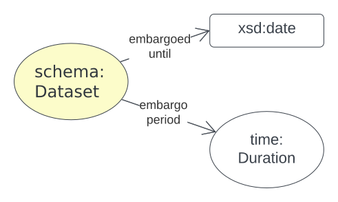

[[annex-d]]
== Annex D: Data Release Model

[#data-release,link="img/data-release.svg"]
.An overview of the Data Release Model

This model is for describing aspects of data release: to whom, under what circumstances and when data may be released.

[NOTE]
====
Currently, the Data Release model only handles data embargos, but it is likely to be expanded as data release/restriction concerns are found to be important within the ABIS community. Please communicate any data release modelling issues to the BDR Team using the <<#data-release-metadata, "Contacts">> details.
====

[[data-release-metadata]]
=== D.1. Metadata

[frame=none, grid=none, cols="1,5"]
|===
|*<<IRI, IRI>>* | https://linked.data.gov.au/def/abis/data-release
|*https://schema.org/name[Name]* | ABIS Data Release Model
|*https://www.w3.org/TR/skos-reference/#definition[Definition]* | This model is for describing aspects of data release: to whom, under what circumstances and when data may be released.
|*https://schema.org/dateCreated[Created Date]* | 2023-10-15
|*https://schema.org/dateModified[Modified Date]* | 2023-12-28
|*https://schema.org/dateIssued[Issued Date]* | 2023-12-28
|*https://schema.org/version[Version]* | 1.0
|*https://www.w3.org/TR/2012/REC-owl2-syntax-20121211/#Ontology_IRI_and_Version_IRI[Version IRI]* | https://linked.data.gov.au/def/abis/data-release/2.0[abisdr:2.0]
|*Version History*| *2.0* - 2023 Dec - First release (v2.0 to match ABIS)
|*https://schema.org/creator[Creator]* | the https://linked.data.gov.au/org/dcceew[Department of Climate Change, Energy and the Environment (DCCEEW)]
|*https://schema.org/owner[Owner]* | https://linked.data.gov.au/org/ausbigg[Australian Biodiversity Information Governance Group (AUSBIGG)]
|*https://schema.org/publisher[Publisher]* | https://linked.data.gov.au/org/dcceew[Department of Climate Change, Energy and the Environment (DCCEEW)]
|*https://schema.org/license[License]* | https://creativecommons.org/licenses/by/4.0/[Creative Commons Attribution 4.0 International (CC BY 4.0)]
|*https://www.w3.org/TR/vocab-dcat/#Property:resource_contact_point[Contacts]* | AusBIGG is supported by DCCEEW's' Biodiversity Data Repository (BDR) Team. Contact the BDR Team on bdr@dcceew.gov.au +
Issue tracking of the ABIS standard is managed online at https://github.com/AusBIGG/abis/issues
|*https://schema.org/codeRepository[Code Repository]* | https://github.com/AusBIGG/abis
|===

=== D.2. Supporting Assets

* RDF schema:
** https://linked.data.gov.au/def/abis/data-release.ttl
* <<SHACL, SHACL>> validation file:
** https://linked.data.gov.au/def/abis/data-release/validator.ttl

=== D.3. Classes

This model defines none of its own classes and only indicates the <<TERNOntology, TERN Ontology>>'s https://linkeddata.tern.org.au/viewers/tern-ontology?resource=https://w3id.org/tern/ontologies/tern/Dataset[`tern:Dataset`] class for use with the predicates it does define.

=== D.4. Predicates

[discrete]
[[embargoedUntil]]
==== embargoed until

[cols="1,5"]
|===
| Property | Value

| <<IRI, IRI>> | `abis:embargoedUntil`
| https://www.w3.org/TR/skos-reference/#prefLabel[Preferred Label] | embargoed until
| https://www.w3.org/TR/skos-reference/#definition[Definition] | A date after which the is no longer embargoed
| https://www.w3.org/TR/rdf12-schema/#ch_isdefinedby[Is Defined By] | This model
| https://www.w3.org/TR/rdf12-schema/#ch_domain[Domain] | https://linkeddata.tern.org.au/viewers/tern-ontology?resource=https://w3id.org/tern/ontologies/tern/Dataset[`tern:Dataset`]
| https://www.w3.org/TR/rdf12-schema/#ch_range[Range] | https://www.w3.org/TR/xmlschema11-2/#date[`xsd:date`], https://www.w3.org/TR/xmlschema11-2/#dateTime[`xsd:dateTime`] or https://www.w3.org/TR/xmlschema11-2/#dateTimeStamp[`xsd:dateTimeStamp`]
| https://www.w3.org/TR/skos-reference/#scopeNote[Scope Note] | The embargo period is understood to cease on the time instance of the start of the object value, e.g. at 00:00:00 (midnight) of a given date, or midnight of the first day of a given month.
| https://www.w3.org/TR/skos-reference/#example[Example] a|
----
# Dataset X is embargoed until the 5th of May, 2024

:dataset-x
    a tern:Dataset ;
    schema:name "Dataset X" ;
    dcterms:embargoedUntil "2024-05-11"^^xsd:date ;
    # ... other dataset properties
.

# Dataset Y is embargoed until 2025

:dataset-y
    a tern:Dataset ;
    schema:name "Dataset Y" ;
    dcterms:embargoedUntil "2025-01-01"^^xsd:date ;
    # ... other dataset properties
.
----
|===

[discrete]
[[embargoPeriod]]
==== embargo period

[cols="1,5"]
|===
| Property | Value

| <<IRI, IRI>> | `abis:embargoPeriod`
| https://www.w3.org/TR/skos-reference/#prefLabel[Preferred Label] | embargo period
| https://www.w3.org/TR/skos-reference/#definition[Definition] | A temporal duration within which the object is embargoed
| https://www.w3.org/TR/rdf12-schema/#ch_isdefinedby[Is Defined By] | This model
| https://www.w3.org/TR/rdf12-schema/#ch_domain[Domain] | https://linkeddata.tern.org.au/viewers/tern-ontology?resource=https://w3id.org/tern/ontologies/tern/Dataset[`tern:Dataset`]
| https://www.w3.org/TR/rdf12-schema/#ch_range[Range] | https://www.w3.org/TR/owl-time/#time:TemporalDuration[`time:TemporalDuration`]
| https://www.w3.org/TR/skos-reference/#scopeNote[Scope Note] | This predicate can only be used if the start of the embargo period's duration can be established by a business or system rule. If it cannot, use <<#embargoedUntil, embargoed until>> instead, with a fixed date.
| https://www.w3.org/TR/skos-reference/#example[Example] a|
----
# Dataset X is embargoed for a period of 3 months, calculated to start
# from the issued date.
# The calculation is defined by a business rule which is not
# expressable in RDF

:dataset-x
    a tern:Dataset ;
    schema:name "Dataset X" ;
    dcterms:issued "2023-12-25"^^xsd:date ;
    abis:embargoPeriod [
        a time:DurationDescription ;
        time:months 3 ;
    ] ;
    # ... other dataset properties
.
----
|===

=== D.5. Validator

#TODO: list and define validators fro this model#