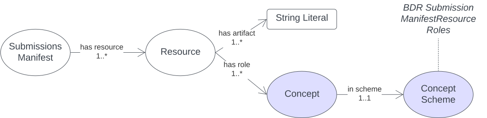

[[annex-e]]
== Annex E: BDR Submissions Manifest Model

[#sub-man-model,link="img/sub-main-model.svg"]
.An overview of the BDR Submissions Manifest Model

This model is for a _manifest_ - a listing of contents - of data submissions to the <<BDR>>.

=== E.1 Metadata

=== E.2 Supporting Assets

=== E.3 Classes

=== E.4 Predicates

=== E.5 Validator

=== E.6 Vocabularies

==== BDR Submission Manifest Resource Roles

=== E.7 Examples

==== E.7.1 MONITOR single

A single RDF file submission from the TERN MONITOR application.

This is a single RDF file - `plant-tissue-lite-protocol-org-uuid-0fb52b7b-29f1-4797-920a-9c88f2180c5e-start-date-2024-12-11T06_53_43.879Z.ttl` - sent from the MONITOR system to the BDR with no additional submission resources, such as image files.

[,turtle]
----
include::examples/annex-e/monitor-simple/submission.ttl[]
----

The manifest above points to the single data file and indicates that its Submission Manifest Resource Role is `SufficientForValidation` meaning this single data file can be validated as-is.

==== E.7.2 MONITOR multi

A multiple file submission from the TERN MONITOR application that includes both an RDF data file and also a number of image files.

[,turtle]
----
include::examples/annex-e/monitor-multi/submission.ttl[]
----

The images are indicated as having a role of `SupplimentaryData` meaning they will be handled in some way (stored) but not validated using ABIS validators. These image files must be linked to from within the submitted data.

==== E.7.3 Gaia archival

A submission from Gaia Resources with multiple RDF files and archival content.

[,turtle]
----
include::examples/annex-e/gaia-archives/submission.ttl[]
----

The survey- and dataset-level metadata stored in the files `dataset.ttl` and `survey-metadata.ttl` has the role `NecessaryForValidation` meaning it must be loaded for other resources to be validated but it is not itself directly validates. This is because it will likely be invalid: it's metadata only and docesn't include the actual core TERN Ontology observations data.

The second resource indicates a number of "chunk" files in a directory, each with the role `IsolatedContent` which means each can be validated in isolation from any other, but must have had the resource with role `NecessaryForValidation` loaded first - the required Dataset & Survey metadata.

The last resource is a set of files in a directory with the role `SubmissionSourceArchive` meaning it's all to be archived - stored in the BDR's provisioned archival storage unit - and not validated. These resources must be linked to from within the submitted data.