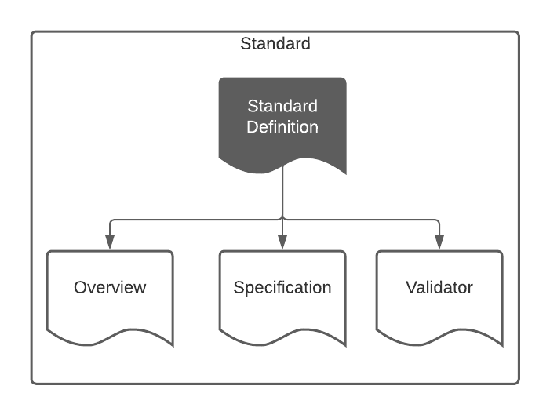

= ABIS Standard's Definition
:toc: left
:table-stripes: even
:sectnums:

[#overview]
.Overview of the ABIS and it's main parts.

== Metadata

[width=75%, frame=none, grid=none, cols="1,5"]
|===
|**IRI** | https://linked.data.gov.au/def/abis
|**Title** | Australian Biodiversity Information Standard
|**Definition** | This is the Standard Definition of the Australian Biodiversity Information Standard (ABIS). It formally defines the parts of the standard.
|**Created** | 2021-12-13
|**Modified** | 2024-09-24
|**Issued** | 2023-12-04
|**Creator** | https://kurrawong.ai[KurrawongAI], https://www.gaiaresources.com.au/[Gaia Resources], https://www.tern.org.au[TERN] and the https://linked.data.gov.au/org/dawe[Department of Agriculture, Water and the Environment]
|**Publisher** | https://linked.data.gov.au/org/dawe[Department of Agriculture, Water and the Environment]
|**License** | https://creativecommons.org/licenses/by/4.0/[Creative Commons Attribution 4.0 International (CC BY 4.0)]
|**Further information** | See the core repository that contains all the resources used to create ABIS: https://ausbigg.github.io/abis
|===         

== Preamble
=== Abstract

This is the Standard Definition of the Australian Biodiversity Information Standard (ABIS). It formally defines the parts of the standard.

=== Normative Status

This Standard Definition is normative for the structure of the ABIS and take precedence over other expressions of the Standard's structure.

== Introduction

This Standard is a multi-part publication that consists of human-readable documents, such as this one, the _Overview_ and _Specification_, and machine-readable artifacts, such as data validators.

This Standard and its parts are defined here in human-readable form and in machine-readable form according to the _Profiles Vocabulary_ <<PROF>>.

The following sections describe the parts and how they relate to each other and other standards using terminology from the Profiles Vocabulary.

NOTE: The document that describes the business rules and other requirements of ABIS is the https://linked.data.gov.au/def/abis/specification[_Specification_], not this document.

=== Profiles Vocabulary overview

The _Profiles Vocabulary_ <<PROF>> is a https://www.w3.org:[World Wide Web Consortium] standard for the formal description of Standards, their parts, and how they relate to other Standards.

The use of the word 'profile' here is due to the way Standards reuse other Standards: if one extends another and remains faithful to its rules, it can be said to _profile_ it.

Standards described using PROF:

* **provide a standard definition**
** this is the overarching description of the standard which is independent of any of the particular resources within the standard
* **describe multiple _resources_ within the Standard**
** each part of a Standard is described using roles, formats, online or other locations and other metadata
** roles are defined formally by a roles vocabulary within PROF
* **indicate what they are profiles of**
** if a Standard extends/constrains another Standard, and many do, this is indicated in a formal way
** data that conforms to a Standard extending another must also conform to all the Standards being extended

=== ABIS Parts

<<resources-table, Table 1>> gives a listing of this Standard's parts, known as _resources_, their roles and their persistent identifers which are also web links to them.

[id="resources-table", width=100%, frame=none, grid=none, cols="2,1,6,2"]
.Resources in this Standard
|===
| Resource | Role | Description | PID

|*Standard Definition*

_(this document)_ 
| *https://agldwg.github.io/prof-roles/profile-definition[Profile Definition]*
| *Defines this Standard's parts and relations to other Standards*
| *<https://linked.data.gov.au/def/abis>*

| Standard Definition - machine-readable
| https://agldwg.github.io/prof-roles/profile-definition[Profile Definition]
| Defines this Standard's parts and relations to other Standards in machine-readable form
| <https://linked.data.gov.au/def/abis.ttl>

| Overview
| https://agldwg.github.io/prof-roles/guidance[Guidance]
| Provides a high-level, non-technical view of ABIS
| <https://linked.data.gov.au/def/abis/overview>

| Specification
| https://agldwg.github.io/prof-roles/specification[Specification]
| The normative ABIS specification
| <https://linked.data.gov.au/def/abis/specification>

| Validator
| https://agldwg.github.io/prof-roles/validation[Validation]
| Machine-actionable validators to test data claiming conformance to ABIS
| <https://linked.data.gov.au/def/abis/validator>

| JSON-LD Context
| https://agldwg.github.io/prof-roles/vocabulary[Vocabulary]
| Machine-readable listing of RDF namespaces used by ABIS
| <https://linked.data.gov.au/def/abis/context.json>
|===

== References

* [[PROF]] World Wide Web Consortium, _The Profiles Vocabulary_, W3C Working Group Note (18 December 2019). <https://www.w3.org/TR/dx-prof/>
